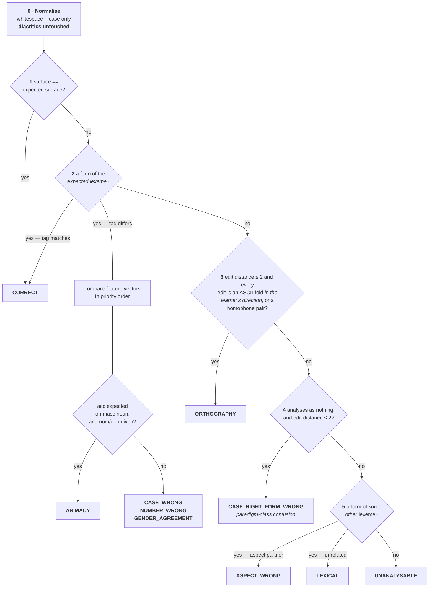
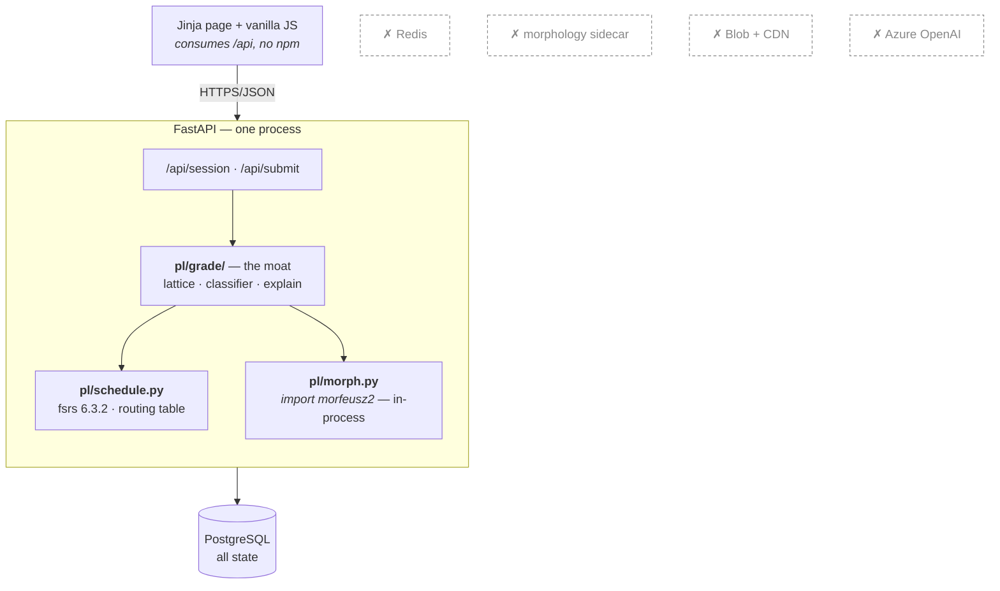
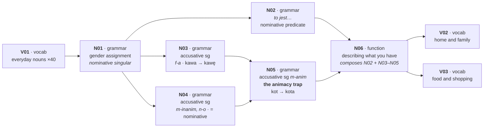

# Polish Learning Platform — Design v1

A morphology-first Polish course for English-speaking adults: a DAG of skill nodes, FSRS scheduling
over three card populations, and a grader that parses what the learner typed and names the
grammatical decision they got wrong.

**Design revision 4**, against `polish-learning-platform-spec.md` draft v0.1 (2026-08-24).

**Status: M0 and M1 are built. M2 is partly built.** This document is no longer purely
forward-looking — where implementation settled a question, the answer is recorded here as fact rather
than as intent, and where implementation contradicted the design, the design is corrected rather than
quietly left wrong. §"Known defects" lists what is broken and unfixed.

Revision 4 was written after a three-pass review of the M2 work and corrects this document against
the code rather than against itself. **Multi-slot items are built** and were still recorded as "not
built, and genuinely hard"; `item_slot` was missing from §8 entirely; `item.audio_url` was described
as the audio seam when it is a dead column. Every headline count was re-measured rather than
adjusted — six were wrong, including a stratification table whose ratio survived but whose numbers
had moved with the lexeme set. Two defects were removed from §"Known defects" because they were
fixed, and **two were added that nobody had written down**: the learner stops meeting new material on
day four, and every listening item is unreachable. Both are the specified rules working as specified,
which is exactly why they needed recording rather than patching.

Revision 3 folds in what building it taught, corrects the phasing estimates (§"The estimates were
calibrated to the wrong constraint"), and finally **defines `paradigm_class`**, which revisions 1 and
2 used eight times without ever saying what it was.

Revision 2 resolved four blocking issues found by interrogating revision 1. Two shared a root:
revision 1 **conflated Polish orthography with Polish morphophonology** — it put `o/ó` in the
orthographic confusion set, which reclassifies the `stół → stołu` / `Kraków → Krakowie` alternation as
a typo that does not fail the grammar card, and it applied every diacritic pair bidirectionally. The
fix is a **directional** rule: an ASCII-fold in the learner's typing direction is orthographic, its
reverse never is. A third was a contradiction inside the moat's own contract — step 2 was specified as
a database lookup in a module declared pure and a phase declared to have no database. The fourth is
`node_unlock`: revision 1 removed the table to save an entity and latched on a monotone column
instead, but **the ratio's denominator moves**, so the fraction was never monotone. **One table is
added; nothing else grew.**

Resolved before designing: **path A with B's data model** (§2); **M0 is the foundation M1 builds on**,
not a throwaway spike; **M1 content is template instantiation, no LLM**; **M1 exercise types are cloze,
MCQ and preposition drill**.

**Read §"What the sources actually say" first.** The licence question the spec marks *Fatal* is
answered — favourably — and seven further facts, recovered from the packaging, from FSRS's own
semantics and from Polish phonology, change the architecture, the unlock rule, the card model and the
classifier materially. Three contradict the spec directly; one corrects revision 1 of this document.

**The single most important structural claim in this document:** the error taxonomy of §4.6 is not a
list of messages. It is the **routing table that decides which cards a submission fails**. Everything
else follows from that.

---

## Scope

### In

- **M0 — the grader.** Morfeusz ingest, tag parsing, the six-step classifier, learner-facing
  explanations, and a hand-labelled golden corpus that is the kill-gate. No DB, no API, no UI.
- **M1 — the learning loop.** Single user, no auth. ~150 lemmas, nominative and accusative, three
  exercise types, FSRS scheduling over **three** card populations, session composition, streak,
  review UI. *(Revision 2 said two. M1's own graph opens with a vocabulary node gating a grammar
  node, so lexical, morphological and pattern cards are all live from the first session.)*
- The full **grading and diagnosis subsystem**, specified to implementation depth, per spec §4.6's
  instruction to specify it before anything else.
- The **data model** in B's shape, so commercialising later needs no migration — including the two
  tables spec §8 is missing.
- **Deterministic content generation** from authored frames × the `form` table. No LLM anywhere in M1.
- Node unlock, mastery gating, and the daily session's composition rules.

### Out

- **M2–M4 in detail.** Each gets a roadmap paragraph and a named seam, nothing more.
- Auth, signup, billing, GDPR/DSAR, support (path A; spec §2's 30-day rule governs when this reopens).
- Leagues, leaderboards, cosmetics, push notifications (spec §6.6, deferred).
- The LLM content pipeline, the human review queue, and TTS (spec §5.2–5.3 — M2).
- Offline review sessions (spec §7 — see §"Offline contradicts server-side grading").
- Redis, the morphology sidecar container, blob storage, CDN, Azure OpenAI — none are M1 components.
- Multi-slot exercise types (free typing, word bank, dictation, reordering) and the two error classes
  that only they can produce.
- FSRS parameter optimisation. Stock parameters until a review corpus exists.
- Any claim about learning efficacy. This design ships mechanics, not evidence.

---

## Acceptance Criteria

### M0 — the kill-gate

1. `morfeusz2` installs and loads on arm64 macOS and on linux/amd64, from the same lockfile.
2. Every Morfeusz tag the M1 curriculum needs parses into a structured feature record, and an
   unrecognised tag raises rather than silently yielding a null feature.
3. Given a lemma, the generator returns the full paradigm, and every **inflected** surface it returns
   re-analyses back to that lemma. Round-trip asserted over the whole lexeme set.
   *Corrected: as first written this criterion is false for SGJP. `generate()` also returns
   abbreviations (`dom` → `d`), adjectival-prefix forms (`duży` → `dużo`) and participial adverbs
   (`czytać` → `czytająco`, which Morfeusz generates but cannot analyse at all). None is an
   inflection and no curriculum cell is drawn from one, so the round trip is scoped to inflection.*
4. **The golden corpus: ≥ 60 hand-labelled `(expected, submitted, error_class)` triples covering all
   eight classes M1 can produce, classified correctly at ≥ 95% overall — and at ≥ 80% within every
   individual class.** This is the gate: if it cannot be met, the thesis is false and the project
   stops here. The per-class floor exists because each class routes to a *different* card outcome
   (§"The error taxonomy is the card routing table") — an aggregate alone lets one systematically
   broken class hide behind seven working ones, and a broken class mis-schedules every card it
   touches.
4b. **The corpus includes vowel-alternation cases even though they are M2 content** — at minimum
   `Krakówie`/`Krakowie` and `stołowi`/`stołu`. They must classify as morphology, never as
   `ORTHOGRAPHY`. These are the regression test for the directional diacritic rule, and without them
   the M0 gate cannot see the error revision 1 shipped.
5. Every classification carries a learner-facing message naming the grammatical decision, not the
   string difference. `"kot is animate, so its accusative borrows the genitive: kota"` — never
   `"expected kota, got kot"`.
6. `Widzę kot` for `Widzę kota` classifies as `ANIMACY`, not `CASE_WRONG`. The masculine accusative
   trap is the first hard concept in the course (spec §4.2) and it must be diagnosed as itself.
7. `matka` for expected `matkę` classifies as `CASE_WRONG`, **not** `ORTHOGRAPHY`. A dropped ogonek
   that lands on another real form of the same lexeme is a case error.
8. `robie` for `robię` classifies as `ORTHOGRAPHY`, and does not fail the grammar card.

### M1 — the learning loop

9. A daily session is served in the order **debt → remediation → new**, composed debt → new →
   remediation, and introduces nothing while more than `DEBT_TOLERANCE` (5) cards are due today.
   *Amended 2026-09-18: as first written this read "composes in the order debt → remediation → new,
   and introduces no new cards while any card is overdue". Both clauses were changed deliberately
   and by measurement, and the criterion was not updated with them: composed in the order it is
   served, remediation starved introduction from day two (§"Session composition"); with no tolerance
   one overdue card shut introduction for the day, and the learner met 123 items where the bound of
   five meets 224 (§"Known defects").*
10. One submission produces exactly one `attempt` row, N `review` rows for the cards it scored, and M
    `error_event` rows — all sharing the attempt, with cards it did not score left untouched.
11. `sklepie` for `sklepu` fails the pattern card and leaves the morph card's schedule unchanged;
    `sklepa` fails the morph card and **passes** the pattern card. Asserted directly as a test.
12. The streak advances only when the day's due cards are cleared **and** the daily goal is met, and
    never on a day where neither happened. Evaluated in the user's own timezone.
13. A node, once unlocked, never re-locks — after a lapse, after a *new pattern card is created* for a
    stratum the learner had not yet met, or after a curriculum edit adds a pattern to a prerequisite.
    All three move the ratio; none may move the gate.
14. Mastery *display* decays with retrievability while the unlock gate does not move.
15. New-card introduction is capped per day, and the cap is honoured even when the learner keeps
    asking for more — by reloading. An extra round the learner explicitly asks for introduces up to
    `EXTRA_ROUND_NEW` (5) more, whatever the day has had, and reviews for the rest.
    *Amended 2026-09-18 at the owner's request, with no daily ceiling on extra rounds: "Another
    round" rebuilt a session whose budget was spent, so it re-served the words just met, and since a
    card moves once a day those answers changed nothing. An extra round still introduces nothing
    past criterion 9's bound, and its review prefers words whose answer will be scored — met before
    today and outside `EARLY_REVIEW_COOLDOWN_DAYS` — over the ones just learnt.*
16. Content: 8 authored frames × the M1 lexeme set yields ≥ 300 items with no manual review, and every
    generated item's expected surface is a real form of its lexeme, asserted at build time.
17. The API returns JSON; no grading logic, no expected answer and no accepted-variant set is ever
    sent to the client before submission.
18. A failed submission whose every token analyses cleanly is written to the promotion queue rather
    than discarded. **Exercised by a synthetic fixture, not by natural traffic** — M1's single-slot
    cloze admits a valid alternative only under syncretism, so the queue is expected to stay empty.
    The write path ships (spec §10 requires it from day one); the criterion is proven by construction.
    *Scoped by the owner, 2026-09-18: **word order only.** Read literally, "every token analyses
    cleanly" admits any mistake made of real words — `kot` for `kota` is one — and it would queue 39
    of the golden corpus's 58 mistakes, every animacy, case, number, gender, lexical and aspect error
    among them, which contradicts "expected to stay empty". A mistake the grader can name is not an
    answer the item failed to anticipate; the right words in another order can be, and `Kota widzę`
    is this document's own example. The owner chose the narrowest reading over the one that would
    also keep a different real word or a missing one. Built as `schedule.queue_for_promotion`.*
19. Traversing `V01 → N01` — a vocabulary node gating a grammar node, the first edge in M1's own graph
    — evaluates the gate over **lexical** cards and never divides by zero.

### Status — audited 2026-09-18

Every criterion was read clause by clause against the code, and every test that claims one was read
to see whether it could fail. Six could not; each was rewritten until removing the behaviour it
guards makes it fail. **Closed** means the behaviour is there and a test proves it.

| # | Status | Proven by |
|---|---|---|
| 1 | **Open** | Loads on arm64 macOS. `uv.lock` pins a `manylinux_2_28_x86_64` wheel, but nothing has loaded it on Linux. |
| 2 | Closed | `test_every_tag_in_the_m1_paradigms_parses`; `test_unknown_pos_raises_rather_than_yielding_a_null_feature` |
| 3 | Closed | `test_every_generated_surface_reanalyses_to_its_lemma`, over all 192 lexemes (was 23) |
| 4 | Closed | `test_golden_corpus_meets_the_gate` — 64 of 65, weakest class `CASE_WRONG` 85.7% |
| 4b | Closed | `test_reverse_fold_is_never_orthographic` and the corpus's `stółu`; `stołowi` for `stołu` checked directly — `CASE_WRONG` |
| 5 | Closed | `test_every_diagnosis_produces_a_message`; `test_message_names_the_grammatical_decision_not_the_strings` |
| 6 | Closed | `test_animacy_is_not_reported_as_a_generic_case_error` |
| 7 | Closed | `test_dropped_ogonek_landing_on_a_real_form_is_a_case_error` |
| 8 | Closed | `test_dropped_ogonek_landing_on_no_form_is_a_spelling_slip`; `test_orthography_does_not_fail_the_grammar_card` |
| 9 | Closed, as amended | `test_debt_past_the_bound_stops_anything_new`; `test_a_small_backlog_does_not_stop_the_curriculum_opening` |
| 10 | Closed | `test_one_answer_writes_one_attempt_and_only_the_fan_out_it_scored`, through `/api/submit` |
| 11 | Closed | `test_the_named_pair_sklepie_for_sklepu_fails_only_the_rule`; `test_wrong_ending_fails_the_form_and_passes_the_rule` |
| 12 | Closed | `tests/test_streak.py` — both conditions, freezes, absence and the timezone boundary |
| 13 | Closed | `test_an_earned_unlock_survives_every_event_the_criterion_names` |
| 14 | Closed | `test_mastery_display_decays_while_an_earned_gate_holds`, and the display through `/api/graph` |
| 15 | Closed, as amended | `test_the_daily_cap_is_not_re_granted_by_asking_again`; `test_an_extra_round_brings_new_words_once_the_day_is_spent`; `test_an_extra_round_waits_while_reviews_are_overdue`; `test_an_extra_round_reviews_what_a_review_would_still_move` |
| 16 | Closed | `test_content_build_produces_enough_items`; `test_a_form_the_analyser_cannot_read_back_fails_the_build` |
| 17 | Closed | `test_no_exercise_type_carries_its_answer`, and the session payload scanned for answers |
| 18 | Closed, as scoped | `test_a_right_answer_in_the_wrong_order_is_kept_for_the_owner`, and through `/api/submit` |
| 19 | Closed | `test_mastery_gate_uses_the_population_the_node_type_implies`; `test_a_diligent_learner_reaches_the_grammar` |

---

## What the sources actually say

Established before designing, because the spec marks one of these *Fatal* and the rest change the
architecture.

### 1. The analyser licence is 2-clause BSD, and it covers the dictionary data

Resolves spec §11 Q2 and retires §10's only **Fatal** row.

`Verified:` [morfeusz.sgjp.pl/doc/license/en](https://morfeusz.sgjp.pl/doc/license/en) places Morfeusz 2
**and its contained linguistic data** under the 2-clause BSD licence. Both dictionary variants are
covered — SGJP (© Saloni, Gruszczyński, Woliński, Wołosz, Skowrońska) and Polimorf (© IPI PAN), with
different copyright holders but identical terms. Commercial use, redistribution and derivative works
are all permitted; the sole obligation is retaining the copyright notices.

The consequence that matters is not "we may call the analyser". It is that the `form` table — which
**ships derived inflectional data** — is lawful to distribute, commercially included. Under a
non-commercial or share-alike licence the entire data model would have needed redesigning around
runtime-only analysis.

**Path B is not licence-blocked.** The older non-commercial restriction some sources still cite
applies to Morfeusz 1, not to Morfeusz 2.

`Assumption:` we adopt the **SGJP** variant, matching spec §5.1. Polimorf is the SGJP–Morfologik merge
and may have wider coverage of colloquial lemmas. Coverage against the M1 lexeme set is a
Validation Required item; the licence is identical either way, so this is a data decision with no
legal component.

### 2. The packaging deletes the sidecar container

`Verified:` from [PyPI](https://pypi.org/pypi/morfeusz2/json), `morfeusz2` 1.99.15 (1 June 2026) ships
**prebuilt `abi3` wheels** for `macosx_11_0_universal2`, `manylinux_2_28_x86_64`, `win_amd64` and
`win32`, with no source distribution. `cp310-abi3` means one wheel serves 3.10 and every later
CPython.

Three consequences:

- **Local development needs no Docker for the analyser.** The universal2 wheel runs natively on the
  arm64 Mac this will be built on.
- **There is no linux/arm64 wheel.** Azure compute must be pinned to x86-64 or the image will not
  build. Cheap constraint, expensive to discover during a deploy.
- **Spec §7's sidecar solves a problem that does not exist.** "The morphological analyser is a native
  library. Wrap it as an internal HTTP service in its own container" is correct reasoning for a
  library you must compile from source with a fragile runtime. This is a `pip install` into the same
  Python process as the API. See §"The analyser is a library, not a service".

### 3. FSRS is a maintained MIT dependency; porting it is strictly worse

`Verified:` [`fsrs`](https://pypi.org/pypi/fsrs/json) 6.3.2 (9 August 2026), MIT, Python ≥ 3.10, whose
only runtime dependency is `typing-extensions`. It exposes JSON serialisation, which maps directly
onto `card.fsrs_state_json` in spec §8. The parameter optimiser is an **optional extra**
(`fsrs[optimizer]`) pulling torch, numpy, pandas and tqdm.

`Verified:` from `fsrs/card.py`, the `Card` dataclass declares **`stability: float | None`** and
`difficulty: float | None` as public attributes, and `CardDict` — what `to_json()` emits — carries
`card_id`, `state`, `step`, `stability`, `difficulty`, `due`, `last_review`. The unlock gate can
therefore read stability directly off deserialised state, which is the fact §"Mastery gates on
stability" depends on.

**Two consequences that are easy to get wrong:**

- **`stability` is `None` until the first review completes.** It is `None` for every card in the
  `Learning` state, which is every card's first several reviews. A naive `max(stability_max,
  stability)` raises `TypeError` on the first update of every card ever created.
- **`Card` carries no `reps` and no `lapses`.** Those columns in spec §8 are the application's to
  maintain, and `reps − lapses` is *not* the count of successful reviews — `lapses` counts `Again`
  only in the `Review` state. The mastery rule's "≥ 3 successful reviews" must be counted from the
  `review` table, not derived from the card.

Spec §4.4 says FSRS "has reference implementations you can port". Depend on it instead: a port is a
correctness liability on the one subsystem whose bugs are invisible for months. **Install the base
package; do not install the optimizer extra** — with one user there is nothing to fit, and stock
parameters are what every FSRS deployment starts on regardless.

### 4. `retrievability ≥ 0.9` is a currency test, not a mastery test

**Contradicts spec §4.4 directly.**

FSRS schedules a card to fall due at the moment its retrievability decays to the desired retention —
0.9 by default. So `R ≥ 0.9` is true **exactly while a card is not yet due**, and false for every
overdue card. It is a restatement of "you are up to date", not a statement about how well anything is
known.

Under §4.4 as written, a learner who takes four days off drops below `R ≥ 0.9` on most cards, the
node falls under the 80% threshold, and **downstream nodes re-lock**. That is the single most
enraging thing a learning app can do, and it would arrive as a consequence of resting.

The time-invariant quantity is **stability**, `S` — defined as the interval at which `R` falls to
0.9. `S ≥ 7 days` says precisely "this is retained for a week", changes only when the card is
reviewed, and does not move while the learner sleeps. See §"Mastery gates on stability, and latches".

### 5. Pattern cards as specified violate FSRS's central assumption

**Contradicts spec §4.4.**

"They are scheduled against the *rule*, and each review draws a random lexeme the learner already
knows" gives a single card a **different difficulty on every review**. FSRS's difficulty parameter is
fitted per card against Anki review logs, where a card's content is fixed for its lifetime. A card
whose content is resampled each time has no stable difficulty to estimate, and the model's
calibration — the entire reason spec §4.4 chose FSRS over SM-2 — does not transfer to it.

The fix costs nothing and improves the pedagogy: **stratify the draw** (§"Pattern cards are
stratified"). It also repairs a second problem in the same sentence — under one-card-per-rule,
§4.4's "≥ 80% of the node's pattern cards" is 80% of 1.

### 6. Morfeusz returns a lattice, and the commonest learner error returns nothing at all

Two facts about the analyser that spec §4.6's pipeline does not account for.

`Assumption:` **the output is a segmentation DAG, not a token list.** Polish is genuinely ambiguous:
`mamy` is both `mieć:fin:pl:pri:imperf` ("we have") and `mama:subst:sg:gen` / `subst:pl:nom`
("mothers"); clitics split (`zrobiłbym` → `zrobił` + `by` + `m`); segmentation itself is ambiguous.
§4.6 step 4 — "compare against the expected analysis for that slot" — presumes a token alignment that
does not exist until something disambiguates.

The ambiguity is a fact about Polish and is not in doubt. What is unverified is the **shape Morfeusz
returns it in** — and since that shape determines the classifier's interface, it is the first thing
M0 checks (Validation Required). Revision 1 asserted this without a label while labelling the
generation claim correctly; the inconsistency is corrected here rather than defended.

The resolution is that **grading never needs disambiguation** (§"Grading is lattice reachability").

**And the commonest error yields an empty analysis.** `sklepa` for `sklepu` is not a Polish word.
Morfeusz returns no analyses, so there are no tags to compare and steps 3–5 have nothing to operate
on. §4.6 has no branch for this — and it is the *majority* case for a learner producing morphology.
Classification must fall back to the generated paradigm, which is what makes Morfeusz's **generator**
load-bearing and the `form` table the **error-classification search space** rather than display data.

`Verified:` generation is a first-class Morfeusz operation — `generate` is a constructor flag, and
the documentation describes synthesis as the inverse of analysis, from lemma plus desired inflectional
characteristics. `Assumption:` the exact Python signature; Validation Required, M0 week 1.

### 7. Normalising diacritics silently passes case errors

**Contradicts spec §4.6 step 1**, which places diacritic handling in *normalisation*.

Polish diacritics are sometimes orthographic and sometimes the entire grammatical signal:

| Typed | Expected | Is the typed string a real form of the same lexeme? | Correct class |
|---|---|---|---|
| `matka` | `matkę` (acc sg) | **yes** — nominative singular | `CASE_WRONG` |
| `tą` | `tę` (acc sg fem) | **yes** — instrumental singular | `CASE_WRONG` |
| `robie` | `robię` (1sg) | no | `ORTHOGRAPHY` |
| `sie` | `się` | no | `ORTHOGRAPHY` |

Normalise diacritics in step 1 and `matka` compares equal to `matkę`, so a learner who has not learnt
the accusative is told they are correct. The rule that separates the two cases is morphological, so
**the operation belongs in classification, not normalisation**: a diacritic difference is orthographic
*only if* the typed string is not itself a valid form of the same lexeme. Step 0 touches whitespace
and case only.

### 8. `o/ó` is morphology, and treating it as a diacritic pair blinds the grader

The error revision 1 shipped, and the reason revision 2 exists. `ó` is **not** a diacritic variant of
`o`. It is a distinct letter pronounced /u/, and the `o`↔`ó` alternation is morphophonological,
triggered by syllable closure — it is the *content* of the paradigms this product teaches:

| Nominative | Oblique | Alternation |
|---|---|---|
| `stół` | `stołu` (gen) | ó → o |
| `Kraków` | `w Krakowie` (loc) | ó → o |
| `wóz` | `wozu` (gen) | ó → o |
| `bóg` | `boga` (gen) | ó → o |

A learner typing `Krakówie` for `Krakowie` has failed the alternation that spec §4.2 point 5 singles
out as the reason locative is taught with palatalisation. Put `o/ó` in the orthographic confusion set
and that learner is told they made a typo, and — per the routing table — **the grammar card does not
fail**. The single most characteristic Polish morphology error becomes invisible.

It is also invisible to the M0 gate, because these alternations appear in the genitive and locative,
which are M2 content, while criterion 4 covers only the classes M1 can produce. The bug would have
been authored at M0 and detonated a phase later. Hence criterion 4b.

**The distinction that matters is direction.** `ą ć ę ł ń ó ś ź ż` all fold to an ASCII base, and a
learner without a Polish keyboard types the base. That is orthographic. The *reverse* — typing a
Polish letter where the base was required — is never a keyboard artefact, because no keyboard produces
`ó` by accident. See §"The six-step classifier", step 3.

`u/ó`, `ż/rz` and `h/ch` are different animals and stay bidirectional: those are genuine **homophone**
pairs (`u` and `ó` are both /u/; `ż` and `rz` both /ʐ/), and confusing them is the archetypal Polish
spelling error for natives and learners alike.

---

## Design Choices

### The error taxonomy is the card routing table

The spine of the design, and the reason the moat is a moat.

One submission touches several cards, and **the error class decides which of them fail**. Consider a
cloze targeting `sklep` in the genitive after `do`:

| Learner types | Why | Pattern card `do`+gen | Morph card `sklep`:gen.sg |
|---|---|---|---|
| `sklepu` | correct | Good | Good |
| `sklepie` | real form, locative | **Again** — wrong case chosen | *not scored* |
| `sklepa` | not a word; `-a` genitive over-applied to a `-u` noun | **Good** — genitive *was* chosen | **Again** — paradigm confusion |

`CASE_WRONG` versus `CASE_RIGHT_FORM_WRONG` is therefore not a message nicety. It is the difference
between two cards' schedules, and grading them together — which any string comparison does — teaches
the learner nothing and mis-schedules both.

- **Design choice:** the classifier returns a `Diagnosis`, and a single declarative table maps
  `error_class → {population: rating}`. No branching in the scheduler.

| Error class | lexical | morph | pattern | M1? |
|---|---|---|---|---|
| *(correct)* | Good | Good | Good | ✓ |
| `ORTHOGRAPHY` | Hard | Hard | Hard | ✓ |
| `CASE_WRONG` | — | — | **Again** | ✓ |
| `ANIMACY` | — | — | **Again** | ✓ |
| `NUMBER_WRONG` | — | — | **Again** | ✓ |
| `GENDER_AGREEMENT` | — | — | **Again** | ✓ |
| `ASPECT_WRONG` | — | — | **Again** | classifier only |
| `CASE_RIGHT_FORM_WRONG` | — | **Again** | Good | ✓ |
| `LEXICAL` | **Again** | — | — | ✓ |
| `UNANALYSABLE` | — | **Again** | **Again** | ✓ |
| `WORD_ORDER` | — | — | **Again** | M2 |
| `MISSING_CONSTITUENT` | — | — | **Again** | M2 |

- **`—` means no `review` row is written and the card's schedule is untouched.** A learner who
  produced a well-formed locative has demonstrated they can inflect `sklep`; failing the genitive
  morph card would conflate "cannot build this form" with "did not know `do` governs genitive", which
  is the exact conflation this product exists to remove.
- **`UNANALYSABLE` is new.** §4.6's taxonomy has no terminal class, and the classifier must have one
  or it will force a wrong label onto input it does not understand. It fails both grammar cards
  (conservative), shows the answer, and is logged for corpus review.
- **`LEXICAL` in a cloze is degenerate** — the lemma is supplied in the prompt, so a different word is
  not lexical ignorance. It is logged and scores nothing. The class becomes meaningful at M2 when
  exercises stop supplying the lemma.
- **Ratings are `Again` / `Hard` / `Good` only. `Easy` is unused in M1.** There is no calibrated
  signal to justify it; `review.latency_ms` is captured from day one so a four-point mapping can be
  *fitted* at M2 rather than guessed now.
- **`Hard` has exactly one producer: `ORTHOGRAPHY`.** Spec §4.6 requires that a spelling slip "do not
  fail the grammar card". `Hard` is FSRS's own semantics for *recalled, with difficulty*, which is
  the true state — and unlike `Good` it does not pretend the answer was clean. This is a semantic
  choice, not a tuned parameter.

### Grading is lattice reachability, not tagging

- `Verified:` Morfeusz emits a segmentation DAG with genuine ambiguity (§"What the sources actually
  say", 6).
- **Design choice:** the grader never disambiguates. It asks whether **there exists a path** through
  the learner's lattice whose analyses match the expected slot sequence. Existence, not argmax.
- No POS tagger, no disambiguation model, no training data, no per-language tuning. This is the single
  reason M0 is three weeks rather than three months.
- When no matching path exists, the classifier finds the **minimally-differing** path, and the nature
  of that difference is the diagnosis. The error taxonomy is the edit vocabulary of that alignment.
- At M1 every item is single-slot, so the lattice reduces to "does any analysis of this one token
  match". The lattice machinery still goes in at M0 because M2's multi-slot items need it and
  retrofitting alignment into a scalar comparison touches every call site.

### The six-step classifier

Specified to implementation depth, per spec §4.6's instruction. Order is load-bearing: **step 2 must
precede step 3**, or every dropped ogonek that lands on a real form is misreported as a typo (§"What
the sources actually say", 7).



- **Step 2 reads the paradigm off `ExpectedSlot`, not out of a database.** Revision 1 specified it as
  `SELECT … WHERE lexeme_id = ? AND surface = ?` inside a module declared pure, in a phase declared to
  have no database — three statements that could not all hold. See §"The moat takes its paradigm as an
  argument".
- **Step 3's confusion set is closed, declared, and *directional*.** Two disjoint mechanisms:
  - **ASCII-folds, one direction only** — `ą→a  ć→c  ę→e  ł→l  ń→n  ó→o  ś→s  ź→z  ż→z`, orthographic
    **only when the learner typed the ASCII base where the Polish letter was required**. This is
    exactly the keyboard case spec §4.6 describes with `sie` for `się`. The reverse direction is never
    orthographic — no keyboard emits `ó` by accident, so `o→ó` is a learner asserting a vowel that
    is not there, which is morphology (§"What the sources actually say", 8).
  - **Homophone pairs, bidirectional** — `ż/rz`, `u/ó`, `h/ch`. Genuine same-sound confusions, and
    unlike the folds they do not encode a grammatical alternation.
  - `o/ó` appears **only** as an ASCII-fold in the `ó→o` direction. It is not a bidirectional pair.
    Revision 1 listed it as one, and that single entry is what made the alternation invisible.

  Worked against every case the design commits to:

  | Expected | Typed | Mechanism | Class |
  |---|---|---|---|
  | `się` | `sie` | fold `ę→e`, learner's direction | `ORTHOGRAPHY` ✓ |
  | `robię` | `robie` | fold `ę→e`, learner's direction | `ORTHOGRAPHY` ✓ |
  | `matkę` | `matka` | — *caught at step 2, a real form* | `CASE_WRONG` ✓ |
  | `Kraków` | `Krakow` | fold `ó→o`, learner's direction | `ORTHOGRAPHY` ✓ |
  | `Krakowie` | `Krakówie` | `o→ó` — **reverse**, no rule fires | falls to step 4 → `CASE_RIGHT_FORM_WRONG` ✓ |
  | `który` | `ktury` | homophone `u/ó` | `ORTHOGRAPHY` ✓ |
- **Step 4 is the branch §4.6 is missing.** `sklepa` is not a word, so there is nothing to compare
  tags against; it is within one edit of `sklepu` and the edit is not orthographic, so the learner
  aimed at the right cell and built the wrong ending. That is the definition of paradigm-class
  confusion.
- `Assumption:` the edit-distance threshold of **2**. Tuned against the golden corpus in M0, not
  before — it trades `CASE_RIGHT_FORM_WRONG` against `UNANALYSABLE` and the right value is an
  empirical question. Validation Required.
- **The `ANIMACY` rule, stated precisely** — because it is the first hard concept in the course and a
  generic `CASE_WRONG` would waste it. Expected case is accusative, lexeme is a masculine noun, and:
  learner gave **nominative** for an *animate* lexeme (`Widzę kot`), or **genitive** for an
  *inanimate* one (`Widzę stołu`). Both are the same misconception with opposite sign, and both must
  say so.
- **Explanations name the decision, never the strings.** `Diagnosis` carries the offending feature and
  the governing rule, and `explain.py` renders from those — so the message is derived from grammar,
  not from a diff. Acceptance criterion 5.

**Two limitations accepted knowingly, rather than engineered around:**

- **Step 3 precedes step 5, so a real word can be called a typo.** `kat` (executioner) typed for
  `kąt` (angle) is an ASCII-fold, so it classifies as `ORTHOGRAPHY` before anything asks whether it is
  a form of some other lexeme. In cloze this is the right answer — the prompt supplies the lemma, so
  the learner was not choosing a word. It stops being right at M2, when exercises stop supplying it,
  and the ordering is revisited then rather than pre-emptively complicated now.
- **An ASCII-fold landing in the *ending* is genuinely ambiguous.** `matke` for `matkę` is classified
  `ORTHOGRAPHY` and does not fail the morph card — but the ogonek *is* the accusative ending. Nothing
  in the input distinguishes "knows `-ę`, has no Polish keyboard" from "believes the ending is `-e`",
  and the design resolves it leniently, matching spec §4.6's instruction not to fail the grammar card
  on a spelling slip. The cost is a real hole in the moat for ending-diacritics specifically. The
  cheap mitigation — an on-screen diacritic strip in the answer input, which removes the excuse and
  makes the lenient reading defensible — is in Optional hardening, not M1.

### The moat takes its paradigm as an argument

Revision 1 made three claims that could not co-exist: step 2 is a `form` table lookup; `pl/grade` is a
pure function of `(ExpectedSlot, str)`; M0 has no database. A pure function of those two arguments has
nothing to look up in, and M0 has no table to query — so the classifier's most important step was
unimplementable as written.

- **Design choice:** `ExpectedSlot` **carries the expected lexeme's full paradigm**, alongside the
  expected `(lemma, morph_tag)` and the lexeme's `gender`, `animacy` and `aspect_partner_id`. The
  signature stays `classify(slot: ExpectedSlot, submitted: str) -> Diagnosis`, and it stays pure.
- Steps 2, 3 and 4 read that paradigm. Only step 5 — *is this a form of some **other** lexeme* — needs
  the open vocabulary, and it calls the in-process analyser, which is not I/O.
- **The two producers of an `ExpectedSlot`:** at M0, `morph.forms(lemma)` directly; at M1, a `form`
  table query. One consumer, two suppliers, no adapter interface and no dependency injection — the
  paradigm of one lexeme is tens of rows, so passing it by value is cheaper than abstracting over
  where it came from.
- This is what makes the golden corpus a **plain data fixture**: a triple plus a paradigm, with no
  database, no fixtures framework and no mocking. It is the reason M0 can gate the project without a
  schema existing.
- The materialisation claim — *paradigms are stored, not generated per request* — survives, but it
  belongs to M1's **caller**, not to the classifier. Stated in the wrong place, it invented a
  dependency the moat does not have.

### The analyser is a library, not a service

**Deletes a component from spec §7.**

- `Verified:` `morfeusz2` is a prebuilt `abi3` wheel installable into the API's own interpreter
  (§"What the sources actually say", 2).
- **Design choice:** `import morfeusz2` in-process. **No sidecar container, no internal HTTP service,
  no cache layer, no `< 50 ms` budget.**
- The `< 50 ms` figure in §7 is a *network* budget. It exists only because of the sidecar, and it
  vanishes with it — an in-process FSA lookup is microseconds. Likewise "cache aggressively" is
  premature optimisation of a call that is already faster than the surrounding ORM query.
- What the sidecar costs: a container image, a deployment unit, an HTTP client, a serialisation
  boundary, a cache with an invalidation story, and a new failure mode on the hot path of the only
  subsystem that matters.
- **The condition under which this reverses:** a Morfeusz instance is not thread-safe or is memory-
  heavy enough that per-worker instances do not fit. Validation Required — measure resident size and
  concurrency behaviour in M0. If it reverses, the wrapper in `pl/morph.py` is the only module that
  changes, because nothing else imports `morfeusz2`.
- **Pin linux/amd64 in both the container image and the CI runner.** `morfeusz2` publishes **no
  sdist**, so on a platform without a wheel `pip` cannot fall back to building — the install fails
  outright. Spec §7 puts CI on GitHub Actions, which now offers arm64 Linux runners; selecting one
  breaks the build in a way that reads as a packaging bug rather than an architecture mismatch. Assert
  the architecture in the same place the container platform is pinned.

### Mastery gates on stability, and latches

**Replaces spec §4.4's threshold.**

- `Verified:` `R ≥ 0.9` holds only while a card is not yet due (§"What the sources actually say", 4).
- **Design choice:** a node is mastered when **≥ 80% of its gating cards have `stability_max ≥ 7
  days`, with ≥ 3 successful reviews spanning ≥ 7 calendar days.** The count and span conditions are
  spec §4.4's, unchanged; only the decaying term is replaced.
- **Design choice — the gating population depends on the node type.** Spec §4.4 and revision 1 both
  said "pattern cards", which is undefined for two of the three node types spec §4.1 declares. M1's
  own graph opens with `V01 (vocabulary) → N01 (grammar)`, so the *first edge the learner traverses*
  evaluated 0/0.

  | Node type | Gating cards | Rationale |
  |---|---|---|
  | **grammar** | its `pattern` cards | the competency is the rule, generalised across a stratum |
  | **vocabulary** | the `lexical` cards of its lexemes | the competency is meaning, and the node has no patterns |
  | **function** | *none* — mastered exactly when its prerequisites are | it composes earlier nodes and introduces no new competency of its own |

  `assert denominator > 0` before dividing, so a mis-authored node fails loudly at session end rather
  than silently unlocking the rest of the course. Acceptance criterion 19.

- **Design choice — the latch is a persisted row.** `node_unlock(user_id, node_id, unlocked_at)`,
  written once when the condition first holds, never deleted.
- **Why a column could not do it, which revision 1 got wrong.** `card.stability_max` *is* monotone.
  The **ratio is not**, because the denominator moves in two ways the design itself creates:
  - Pattern cards are created **lazily** — the draw excludes strata whose known-lexeme intersection is
    empty. A learner reaches 3/3 and unlocks; later they meet a lexeme in the fourth stratum, its card
    is created, and 3/4 = 75% **re-locks the node**. That is an M1 failure, not a hypothetical.
  - Content is **rebuilt, not migrated**, so adding a paradigm class to a node at M2 re-locks every
    node downstream of it.

  Revision 1 traded a table for a column and got an incorrect latch in exchange. One row per unlocked
  node is the only representation that survives both.
- **`card.stability_max` stays**, as the card-level high-water mark the gate reads — `max()` over the
  card's history is the right measure whether or not the ratio is latched, and it saves the gate from
  replaying `review` rows. `Verified:` `Card.stability` is `float | None` and is `None` throughout the
  `Learning` state, so the update is `stability_max = max(stability_max or 0.0, stability or 0.0)`.
  Without the guard, every card raises `TypeError` on its first review.
- **"≥ 3 successful reviews" is counted from `review`**, as `COUNT(*) WHERE card_id = ? AND rating >=
  Good`. `Verified:` `Card` carries neither `reps` nor `lapses`, and `reps − lapses` is not the same
  quantity — `lapses` counts `Again` only in the `Review` state.
- **Unlock is about access; scheduling is about retention.** Separating them is what lets §6.5's
  mastery visualisation fade with retrievability (which is what makes it informative) while nothing
  the learner has earned is taken away. Acceptance criteria 13 and 14 assert both halves.
- **Design choice:** evaluated once at session end, not per review. Nodes never unlock mid-session,
  which would inject unlocked material into a session already composed.

### Pattern cards are stratified

**Replaces spec §4.4's random draw.**

- `Verified:` resampling content per review destroys the per-card difficulty FSRS estimates
  (§"What the sources actually say", 5).
- **Design choice:** a pattern card is **(rule, paradigm class)**, not (rule). Draws within a card are
  drawn from one stratum, so difficulty is homogeneous and FSRS's assumption holds.
- The mastery claim becomes honest and *stronger*: mastering `ACC_AFTER_TRANSITIVE_VERB × m-anim`
  means generalisation across masculine animate nouns, which is the real competency. The unstratified
  version could be satisfied by luck of the draw.
- **This is what makes "≥ 80% of the node's pattern cards" a meaningful fraction.** M1's accusative
  node carries four strata — `f-a`, `m-inanim`, `m-anim`, `n-o` — so 80% means three of four, and the
  learner may carry one weak paradigm class forward while the other three are solid. Under
  one-card-per-rule the threshold was 80% of 1.
- **Design choice:** the draw still excludes lexemes the learner has not met — a pattern card draws
  from `{lexemes in stratum} ∩ {lexemes with a lexical or morph card}`. If the intersection is empty
  the card is not scheduled.

### `paradigm_class`, defined

Revisions 1 and 2 used this key eight times — as a `lexeme` column, as half of `pattern`'s unique
constraint, and as the thing the whole stratification rests on — **without ever defining it**. It was
the single largest hole in the design, and it is the kind of hole that looks harmless because every
sentence around it reads as if the definition is somewhere else.

- **It cannot be derived from gender.** `Verified:` `sklep` and `chleb` are both `m3` and take
  `sklepu` / `chleba`; `kawa` and `książka` are both feminine and take `kawy` / `książki`. Gender
  predicts the accusative and nothing past it, so a gender-keyed stratum looks correct for the whole
  of M1 and silently mixes difficulties from M2 onward — the exact FSRS violation stratification
  exists to prevent.
- **Design choice:** it is the lexeme's **own endings**. Strip the longest common prefix of the cells
  in scope; key on what is left, prefixed by gender. Two lexemes share a class when every ending
  matches. Stem alternations fall out correctly rather than being special-cased: `stół → stołu` keeps
  `ół`/`ołu` where `sklep → sklepu` keeps ``/`u`, so the alternating noun lands in its own class,
  which is right — the alternation is a separate thing to learn.
- **Design choice: the key is per *rule*, not global.** Each rule declares `stratify_cases` and sees
  only the cases it teaches. This is not a refinement, it is a correctness requirement:

  | Stratification | Accusative node | Locative node |
  |---|---|---|
  | global, over all five cases | **33 strata** | 33 strata |
  | per rule | **8 strata** | 28 strata |

  `Verified:` re-measured at this revision over the 58 nouns of 76 lexemes; the figures were 27 and 7
  at 57 lexemes, and the ratio is what matters, not the absolute count. Under a global key, adding
  the locative re-partitions the *accusative* node from 8 strata to 33 — so a learner who had
  mastered the accusative wakes up with two dozen
  strata they have never seen and a node that is no longer mastered. **Strata are content, and the
  unlock gate counts them**, so re-partitioning a rule the learner has already cleared silently
  revokes it. Keying each rule to its own cases means a curriculum edit cannot disturb any rule that
  does not teach the thing being edited.
- **Design choice:** verbs stratify on **present-tense conjugation**, because that is where Polish
  conjugation classes diverge — `czytam/czytasz`, `robię/robisz`, `piszę/piszesz`. Case is not a verb
  feature and is ignored rather than misapplied.
- **Design choice: strata are derived from the frames that populate them**, never from a node's
  gender list. A stratum sits in the unlock gate's denominator whether or not any item exercises it,
  so one unpopulatable stratum makes its node permanently unmasterable and everything downstream
  unreachable — and the gate cannot see it, because it only raises when a node has *no* strata at
  all. `Verified:` this happened twice during M2 and was caught both times by a content invariant
  test asserting every stratum has at least one item.
- **The known cost:** extending a rule's `stratify_cases` re-partitions that rule's strata and needs
  a re-ingest. That is cheap and local. It is also why ingest must be an **upsert** — an ingest that
  short-circuits on the lemma leaves stale classes in place, builds new strata from them, and reports
  a successful build.

### Cloze does not score lexical cards, and the node type says so

- In cloze-with-lemma-prompt the lemma is **printed in the prompt**. Meaning is not under test, so
  scoring a lexical card on it would credit knowledge the exercise did not probe.
- **Design choice:** `node.type` determines which populations an item scores — a **grammar** node
  scores morph and pattern, a **vocabulary** node scores lexical. No new field; the rule reads off
  spec §8's existing column.
- **The two rules compose by intersection, and this must be stated or it will be miswired.** The
  routing table says what rating a population *would* get; `node.type` says which populations are
  *eligible*. The effective set is the intersection — which means **the routing table's `lexical`
  column is dead under every grammar node**, and cloze never touches a lexical card no matter what the
  table says. Read either rule alone and you get a cloze exercise crediting vocabulary knowledge it
  did not test.
- **Consequence for M1's three types:** MCQ therefore does double duty — form selection under a
  grammar node, meaning recall under a vocabulary node. Same exact-match grading path, same table,
  different parent node. This is how M1 gets a vehicle for lexical cards without a fourth exercise
  type.

### Session composition: debt, then remediation, then new

Spec §4.6 says the weakest node drives the next session; §6.2 says the streak requires clearing review
debt. Both need an explicit ordering to be implementable.

- **Design choice:** the session is built in three segments, in order.
  1. **Debt** — every card with `due_at ≤ end of the learner's local day`, ordered by `due_at`.
  2. **Remediation** — items from the weakest node, by error rate over a trailing 14-day window,
     injected only after debt is exhausted.
  3. **New** — items from unlocked, unstarted nodes, **only if debt is clear** and the daily goal is
     not yet met.
- **Design choice, added after measurement: the segments are *served* in that order but *composed*
  debt → new → remediation.** This is not a contradiction, and stating it as one ordering is what
  made the composer unusable for a revision. Remediation has an appetite for the entire session and
  no natural stopping point — the weakest node always has more items — so whichever segment is
  composed after it receives nothing. Composed last, against the room the other two left, it still
  fills every session that debt and introduction do not; composed second, as this list reads, it
  starves introduction permanently from day two. See §"Known defects" for the measurement. **A
  segment with no budget is a segment that takes everything.**
- **Design choice: a daily new-card cap, default 10, configurable.** Without one, an enthusiastic
  first evening creates a debt spike three days later that reads as punishment for engagement, and it
  is the standard way self-hosted SRS deployments fail. Acceptance criterion 15.
- **Design choice:** "weakest node" is a rate, not a count — otherwise the node with the most items
  always wins.
- **Design choice: no cap on total session length at M1. Stated as a decision, not left as an
  omission.** New cards are capped; overdue cards are not. A learner returning after two weeks is
  served the whole backlog in one sitting, and because criterion 12 requires debt cleared *and* the
  goal met, a partial clear earns no streak — the mechanic meant to prevent churn bites hardest at the
  moment churn is most likely. No acceptance criterion requires a bound, and path A has one user who
  can simply stop, so building one now would be a mechanism without a criterion. **The counter-
  mitigation ships instead:** streak freezes (§"Streak") make the absence recoverable, which is the
  cheaper half of spec §6's own caveat. A backlog cap is in Optional hardening, and it is the first
  thing to reconsider if a second learner ever exists.
- **Design choice:** remediation items **do write `review` rows**, even for cards that are not yet
  due. Reviewing early raises stability less than reviewing on time — FSRS models this rather than
  breaking on it — and the alternative, remediation that does not count, means the learner drills
  their weakest node for no scheduling credit. The rating is recorded normally; the routing table does
  not special-case remediation.

### Streak: both conditions, and a real timezone

- **Design choice:** the streak advances when the day's due cards are cleared **and** the daily goal
  is met. Spec §6.2 gives only the first, which advances the streak for free on a day with no due
  cards — including day one, and including a learner who has drifted into having nothing due.
  Requiring both makes §6.1 and §6.2 each load-bearing instead of redundant.
- **Design choice, added after measurement:** the default goal is `DAILY_NEW_CAP` items — the most a day
  with nothing due can offer, since the cap counts cards and an item costs one or two — so such a day
  can usually meet it, where a goal of twenty never could; and "the day's due cards are cleared" means each has had its turn — an
  item that may score it was answered — not that each was scored, because the routing table
  deliberately leaves some cards unscored on some errors. See §"Known defects".
- **Design choice:** the day boundary is the learner's local midnight, from an IANA timezone in
  `user.settings_json`. `streak.last_completed_on` is a local date. Spec §8 has no timezone anywhere,
  and a UTC boundary silently breaks the streak for anyone west of Greenwich in the evening.
- **Design choice:** freezes — cap **2**, one earned per 10 days *of advanced streak*, consumed
  automatically at the first missed day, most recently earned first. Spec §6.3 gives the numbers but
  not the trigger or the accrual basis.
- **Design choice:** the session screen shows retained-lexeme count and node mastery beside the
  streak, per spec §6's own caveat. Costs one query; it is the thing that survives a broken streak.

### Beyond the streak: unlocks and milestones

The streak, its freezes and the daily goal were the whole of the reward surface, rendered as three
numbers in a header. Two things are added here, and both are deliberately quiet.

- **The unlock moment.** `evaluate_unlocks` already computed which nodes opened at the end of a
  session, and the API returned the bare key — the learner was told `N01`, which is the database's
  name for the thing and says nothing about what they earned. It now returns the node itself, and the
  session screen renders the title and the first sentence of its explanation. **Nothing was computed
  that was not already being computed; it was being thrown away one layer from the screen.**
- **Milestones.** Three standings — cards remembered a week, distinct words met, days in a row —
  each against the next round number. **Deliberately a standing, never "you just crossed one."**
  Announcing a crossing needs a column recording which milestones have already been announced, and a
  milestone announced twice teaches the learner that the number is decorative. A standing is true
  every time it is rendered, and costs no schema.
- **Design choice: the session screen shows the nearest milestone only; the progress page shows all
  three.** Three meters at the end of a session is a dashboard, and a dashboard is not encouragement.
  The progress page is somewhere the learner chose to go, so it can afford the full picture.
- Three counts rather than one composite score, for the same reason `progress` returns retention
  beside the streak: they answer different questions, and a single number hides whichever is bad.

### M1 content is deterministic instantiation

- **Design choice:** an M1 item is an authored **frame** × a lexeme, resolved against the `form`
  table. `data/frames.yaml` holds ~8 frames; the M1 lexeme set holds ~40 nouns in scope for cases 1–2.

  ```yaml
  - id: ACC_TRANSITIVE_WIDZIEC
    node: N05-accusative-singular
    pattern: ACC_AFTER_TRANSITIVE_VERB
    template: "Widzę ___ ({lemma})"
    gloss:    "I see a {en_gloss}"
    target:   {pos: subst, number: sg, case: acc}
    admits:   [m-anim, m-inanim, f-a, n-o]
  ```

- Eight frames × forty lexemes yields **≥ 300 items with zero review burden**, because the expected
  surface is *looked up*, not written — it cannot be wrong unless SGJP is wrong.
- **No Azure OpenAI, no generation pipeline, no validator, no review queue, no reviewer at M1.** Spec
  §5.2's pipeline exists to produce *communicative context*, which is an M2 need. Drilling morphology
  needs frames, and a frame is more reliable than a reviewed sentence.
- **Design choice — the M2 seam is declared now** so nothing blocks it: `item.source ∈ {template,
  generated}`, and the LLM pipeline writes to the same `item` table through the same build-time
  assertion that every expected surface is a real form (acceptance criterion 16). The frame builder
  and the LLM pipeline are two producers of one validated interface.
- **Design choice:** `data/lexemes.yaml` is hand-curated, per spec §5.1's warning that frequency ≠
  teachability. Frequency rank is carried but does not order the curriculum. This answers spec §11 Q4
  for the first 500: **theme-driven, with frequency as a tiebreak**.
- Content is rebuilt, not migrated — items are a pure function of frames × lexemes, so regenerating is
  always safe. Cards reference `form` and `pattern`, never `item`, so regeneration never orphans a
  schedule. This is why §"Data model" moves the card's referent off `item`.
- **"Rebuilt, not migrated" is true of adding content and false of removing it.** The build is an
  upsert and never deletes, which is right — an item may already carry attempts and error events, and
  editing a frame is not a reason to rewrite what the learner did. But it means a *narrowing* edit has
  no effect on a database that already has the wider content: the 121 sentences the theme gates below
  removed were all still stored, and still being served, after a successful rebuild. `ingest.main`
  now reports them and deletes nothing; the operator decides.

### Free translation accepts one word order, deliberately

- Polish word order is freer than the grader is. `Widzę kota` is the only accepted answer; `Kota
  widzę` is graded `WORD_ORDER` and fails the rule card, though a native speaker would accept it
  under contrastive stress.
- **Design choice: teach one neutral order at A1 and record the cost.** A beginner benefits from a
  single model order, and the alternatives carry information (emphasis) that the course does not yet
  teach. Decided by the owner, who is a native speaker, as the right trade at this level.
- **The mechanism to lift it already ships.** `item_variant` exists, the write path exists, and
  criterion 18 describes exactly this — a valid answer the item did not anticipate entering the
  accepted set. It ships empty because M1's single-slot cloze admits alternatives only under
  syncretism; multi-slot free translation is the first exercise that produces them in quantity. When
  word order stops being a simplification worth making, this is where it is undone, and no schema
  changes.

### A preposition agrees with the word that follows it

- `Verified:` Polish writes `we wsi`, not `w wsi`. Before a cluster the bare preposition cannot be
  said against, `w` takes the form `we` and `z` takes `ze`.
- **The trigger is the following word, so it cannot live in the frame.** One template has to yield
  both `Jestem w szkole` and `Jestem we wsi`, which means the fix belongs where the item is made.
  `frames.euphonic` applies it.
- **This is the class of error the "looked up, not written" guarantee does not cover**, and it went
  unnoticed for the whole of M1. Every expected *surface* is a real form and cannot be wrong unless
  SGJP is wrong — but the frame around it is authored, and nothing checks that the authored part
  agrees with the looked-up part. Every M1 locative happened to be safe (`w szkole`, `w domu`,
  `w Krakowie`); adding one noun whose locative is `wsi` produced `Jestem w wsi` and a successful
  build. **Content correctness is not one guarantee but two, and only one of them was covered.**
### Which preposition a place takes is lexical, and lives on the lexeme

- `Verified with the owner, a native speaker:` it is **`na uniwersytecie`**, not `w uniwersytecie`,
  and **`na wsi`**, not `we wsi`. Both were built wrong.
- **Nothing derives this.** Not gender, not paradigm class, not theme: `w szkole` but
  `na uniwersytecie`, `w mieście` but `na wsi`. It is a fact about the word, so
  `lexemes.yaml` carries `locative_preposition` and `frames.place_preposition` applies it.
- **Two different corrections, applied in that order.** *Which* preposition is lexical and comes from
  the lexeme; *how to say it* is phonological and comes from `euphonic`. `wieś` needs both answers and
  they disagree — `we wsi` is the correct way to say the **wrong** preposition. Substituting first
  matters, because `na` has no syllabic variant to ask about.
- **This is the same lesson as `we wsi`, one level up, and it is the one worth keeping:** the M1
  guarantee is that a generated *surface* cannot be wrong, because it is looked up rather than
  written. Everything around the surface — the preposition, the frame, the gloss — is authored, and
  nothing checks it. Two defects of that shape have now been found in as many days, both by reading
  the sentences out loud rather than by any test. **A content pipeline that validates morphology and
  nothing else validates one word in three.**
- Still open, and *not* guessed: nouns taking `na` for place also take `na` + **accusative** for
  direction, where the course currently builds `do` + genitive. `Idę do wsi` and `Idę na wieś` are
  both grammatical and mean different things, so this is a curriculum choice rather than an error —
  but it is unmodelled, and the same field would carry it.

### Frames are gated by theme, so nonsense does not scale with vocabulary

- **The problem is multiplicative.** An ungated frame produces one sentence per lexeme, so an unsuitable
  pairing is one bad sentence *per unsuitable noun*. At 76 lexemes `Kupuję szkołę` ("I am buying the
  school") is a curiosity; at the 2,000–3,000 conversational B1 needs it is a systematic defect, and
  it arrives at exactly the moment content work starts paying off. Gating is therefore a prerequisite
  for scaling vocabulary, not a polish pass after it.
- **Design choice:** `themes` on a frame admits only the lexemes it reads sensibly with. `Verified:`
  applied to the eight ungated core frames this removes 139 sentences — `Kupuję sklep`, `Kupuję morze`,
  `Mam kościół`, `Widzę czas`, `Czekam na krzesło` — and adds none.
- **Design choice: a lexeme may carry several themes**, because a noun can honestly be several things.
  `dom` is a venue you go to *and* a home you own; with one theme apiece, gating "Mam ___" away from
  venues to stop `Mam kino` also stops `Mam dom`. `Verified:` multi-theme recovers 25 good sentences
  the single-theme version had cost — `Mam dom`, `Kupuję rower`, `Nie mam pracy`, `Interesuję się
  pracą` — while keeping all 115 absurd ones out. Written as `themes: [venue, home]`; `theme:` still
  works for the ordinary single case.
- **Gating narrows a node rather than emptying it, and that is the failure mode to guard.** Strata are
  derived from the frames that populate them, so a gated frame removes its stratum rather than leaving
  it item-less. `Verified:` gating every accusative frame to `people` takes N04 from three strata to
  two and N05 from four to two — the build succeeds, no stratum is empty, no test fails, and the node
  silently stops teaching neuter and masculine-inanimate accusatives.
- **Design choice:** every rule that genuinely applies to any noun keeps one **ungated** frame —
  `NOM_CITATION`, `TO_JEST`, `LUBIE`, `GEN_NIE_MA`, `LOC_O`. You can name, point at, like, lack or
  think about anything. `test_the_universal_rules_still_reach_every_noun` is the guard, and it is what
  makes gating the *other* frames safe to keep adding. Rules that are not universal — `INST`,
  `GEN_POSSESSION`, `GEN_PREPOSITION` — are wholly theme-scoped on purpose: "Idę do ___" is a sentence
  about venues, and a stratum it never reaches is one that rule was never teaching.

### Vocabulary grows in themed nodes, and a word comes before its endings

Adding words was expected to be volume work, not design work. Measured, it was not: the graph did
not scale with its vocabulary, in two ways.

- **V01 gated on every noun.** A vocabulary node's gate is 80% of the senses it owns, and V01 owned the
  whole noun set — so each noun added pushed back N01, and everything behind it. `Verified:` 121 more
  nouns took N01 from day **20** to day **54.5** at 85% accuracy, and nodes opened in ninety days from
  8 to **4**. Nine of those nouns also added N05 strata; leaving them out changed nothing, so the gate
  was the cause.
- **A vocabulary node open beside the grammar splits the day's budget with it.** Introduction is
  round-robin by node. Fixing the gate alone — themed nodes opening straight after V01, or V01 gating on
  a core subset, or on a fixed count of 52 words (the last two identical in effect) — brought N01 back to
  day 20 but took N03 from day 41 to 62–64 and N05 from 56 to 75–79, because N01's share of ten cards a
  day fell from all of it to a half or a third.
- **Design choice: new words belong to themed vocabulary nodes that open after N06.** `V02` Home and
  family, `V03` Food and shopping. A lexeme names its node with `vocabulary_node`; the default is V01,
  which keeps its 64 nouns and its gate. N06 is where the accusative — the course's first hard concept
  — is done, and nothing on the grammar path depends on V02 or V03.
- **Design choice: grammar introduces a word only after its meaning item.** Opening the themed nodes
  late is only safe with this. Grammar items are built for every noun, so without it `lodówka` reaches
  the learner as "Write the Polish for *fridge*": `Verified:` 52 of the 116 words a learner met over
  ninety days arrived through a grammar item first, and 51 of them never through their meaning item.
  Applied to the words a vocabulary node owns — verbs have senses but no meaning items, and keying the
  rule on "has a sense" would stop every aspect item from being introduced.
- **The rule has a deadlock in it, and the build refuses it.** A stratum counts toward its node's gate
  from the moment it exists. If every noun populating it is taught by a vocabulary node downstream of
  that grammar node, its items wait for a meaning card that waits for the node that waits for them.
  `Verified:` `ojciec`, `mąż`, `gość`, `dziadek`, `wujek`, `kolega`, `mężczyzna`, `sprzedawca` and
  `kierowca` in V02 gave N05 five such strata; N05 was never mastered on any seed, and a flawless
  learner's streak fell to 36 days. `frames.assert_every_stratum_is_reachable` names the strata and
  their nouns. Those nine are held back for a later round, which needs a way into N05 that V02 cannot
  give them.

Six seeds × ninety days, median:

| | nodes (85% / flawless) | items met | N03 day | N05 day | N07 day | words met through grammar first |
|---|---:|---:|---:|---:|---:|---:|
| 82 lexemes, before | 8 / 9 | 443 / 502 | 41 / 36 | 56 / 45.5 | 70.5 / 58.5 | 10 / 18 |
| +121 nouns in V01 | 4 / 5 | 236 / 393 | 86.5 / 70.5 | — / 81 | — / — | 0 / 0 |
| themed nodes after V01 | 7 / 7 | 360 / 435 | 64 / 59 | 75 / 70 | — / — | 0 / 0 |
| themed nodes after N06, no word-first rule | 5 / 10 | 532 / 711 | 41 / 36 | 71 / 45.5 | — / 81.5 | 52 / 85 |
| **after N06, word first, 110 nouns** | **10 / 10** | **460 / 568** | **41 / 36** | **56 / 45.5** | **70.5 / 58.5** | **3.5 / 15** |

V02 and V03 open when N06 does, which the two rules below bring forward to day 57 at 85% accuracy from
the 70.5 the smaller vocabulary managed.

**On its own the themed-node change was not free, and ninety days hid that.** V02 and V03 open on the
same day as N07 and N12, so introduction round-robined over four nodes where it used to use two.
Measured to 150 days, seeds 1–4: a flawless learner's N08 moved from day 76 to **125**, and N09, N10
and N11 — which opened on days 99, 99 and 111 — did not open at all. At 85% accuracy N08 opened around
day 110 before and did not open at all after. That is what the two rules below were added to answer.

Two rules were added in response, and with them the course is faster than it was before the words
were added, not merely faster than P4:

- **Introduction takes an item that opens an unstarted stratum before another form of one already
  started.** Two passes over the same pools, the first admitting only stratum-openers. A node is
  mastered through its pattern cards, so a second noun in a started stratum spends one of the day's ten
  cards and moves no gate. Ordering *within* a node was measured and is not enough — the round-robin
  still gives every vocabulary pool its turn, which left N08 on day 118.5 rather than 99.5.
- **An answer to a card that is not due advances its schedule at most once every three days**
  (`EARLY_REVIEW_COOLDOWN_DAYS`). Without it the stratum-first draw stalled one learner in twelve: any
  item scores the cards it touches, so a 105-item stratum's pattern card was rated 30 times in 36 days,
  median gap one day, and its stability stalled at **3.2** against the seven-day bar while a quiet card
  in the same node reached 21.5. The bound is measured — see `pl/schedule.py`; two days still stalled
  and five cost coverage. The design's decision that remediation writes reviews for cards that are not
  yet due is bounded by this, not reversed.

Twelve seeds × ninety days at 85%, and four seeds × 150 days:

| | nodes (12 seeds) | items met | N06 opens | N08 opens | stalls |
|---|---|---:|---|---|---:|
| before, 82 lexemes | 8 [8–8] | 453 | 12/12, day 70.5 | 0/12 | 0 |
| 192 lexemes, id order | 11 [5–11] | 439 | 11/12, day 51 | 9/12 | 1 |
| **192 lexemes, both rules** | **11 [10–11]** | **487** | **12/12, day 57** | **11/12, day 77** | **0** |

At 150 days the same learner meets 775 items against 650 and opens N07 on day 57.5 against 75.5, N08 on
83.5 against 109; a flawless learner opens fourteen nodes against twelve and meets 995 items against
728. **What is still slower is the tail:** a flawless learner's N09 and N10 land on day 127 against
100.5, and N11 on 142 against 113, because those gates grew with the vocabulary — N11 from 31 strata to
43, so `strata_needed` is 35 rather than 25. At 85% accuracy nothing past N08 opens within 150 days,
against N09 and N10 on one seed of four before.

Three other ways out were measured and rejected:

- **Open V02/V03 later, after N08 or N11.** Refused by the build, and correctly: the new nouns put
  strata into N07, N08 and N11 that only V02/V03 words populate — `babcia`, `kuchnia`, `pokój`, `nóż`,
  `cukier` — so those nodes wait on words that wait on them. The reachability guard names all seven.
  This is the same deadlock that held the nine masculine personal nouns back, and it says something
  general: a vocabulary node can only open *before* the nodes whose strata its own words create.
- **V03 behind V02.** 780 items against 756 at 85%, and N08 still never opens; it moves N08 for a
  flawless learner from 125 to 119.
- **Cap vocabulary at three of the day's ten cards.** Measured twice: capping V01 too delays N01 and
  everything after it, and capping only once grammar is open still left N08 on day 136.5. The budget
  was never the problem — what the budget was spent *on* was.

### Offline contradicts server-side grading

**Two spec §7 constraints that cannot both hold.**

- "The review session must work offline once loaded" and "grading runs server-side" are incompatible:
  offline means no diagnosis until reconnect, and a diagnosis the learner reads on the train home is
  not feedback.
- The asymmetry worth noting: **client-side grading leaks answers, which is fatal for path B and a
  non-issue for path A** — you would be leaking answers to yourself. So offline is *cheap* precisely
  in the path we are building and expensive in the one we are keeping open.
- **Design choice:** keep grading server-side, defer offline past M1. Building the client-side grader
  now would fork the moat into two implementations that must agree, for a benefit that expires the
  moment a second user exists.
- Revisit at M2 with the honest options: a bounded pre-fetched session graded on-device (path A only),
  or accepting deferred feedback for review-only sessions.

### M1 architecture: three components



- **Design choice:** the four struck components are all M2+. Redis is a hot-card cache for a user
  count of one; blob/CDN arrives with audio; Azure OpenAI arrives with generated content; the sidecar
  is deleted permanently.
- **Design choice: PostgreSQL from M1, not SQLite.** The whole premise of path A is B's data model
  with no rewrite, and `fsrs_state_json` wants JSONB. A SQLite→Postgres migration means re-testing
  every query, which is exactly the rewrite §2 promises to avoid. Docker Compose in dev; Flexible
  Server later, pinned x86-64.
- **Design choice: no React and no npm at M1** — a deviation from spec §7's `PWA (React + TS)`. The
  M1 review session is one screen. FastAPI serves JSON from `/api/*` and a Jinja page consumes it with
  vanilla JS, matching the stack already proven in `voice-to-quote`. **Because the API is JSON-first,
  M2's React PWA replaces the page and not the backend** — the deviation costs nothing later and saves
  a build pipeline, an API contract and a state library now.
- **Design choice: M1 binds to localhost only, and says so.** There is no auth at M1, so `/api/submit`
  is an unauthenticated write endpoint; that is safe on a loopback interface and a defect anywhere
  else. If it ever needs to reach a phone on the same network, the minimum is a single shared secret
  in a header — five lines, and it stops M2's real auth from being retrofitted onto an open surface.
  Revision 1 drew HTTPS in this diagram and never stated the posture.
- **Design choice:** `pl/grade/` imports nothing from `pl/api.py`, `pl/models.py` or the ORM. The moat
  is a pure function of `(ExpectedSlot, str)` — and `ExpectedSlot` carries its own paradigm
  (§"The moat takes its paradigm as an argument"), so the purity claim holds against every step of the
  classifier rather than only the first. That is what makes the golden corpus a unit test and M0
  possible with no schema at all.

---

## Data model

Spec §8 with three tables added and three columns changed. Additions approved at the simplicity
checkpoint; every one is justified against an acceptance criterion.

```
lexeme            id, lemma, pos, gender, animacy, aspect,
                  aspect_partner_id, paradigm_class, frequency_rank
form              id, lexeme_id, surface, morph_tag, is_irregular
                  ── UNIQUE (lexeme_id, morph_tag); INDEX (lexeme_id, surface) ★
                  ── curriculum lexemes only, not all of SGJP ★
sense             id, lexeme_id, en_gloss, register, notes
node              id, type, title, cefr_level, explanation_md
node_prereq       node_id, prereq_node_id
node_lexeme       node_id, lexeme_id

pattern         ★ id, node_id, rule_key, paradigm_class
                  ── UNIQUE (rule_key, paradigm_class)

item              id, node_id, exercise_type, prompt, expected_answer,
                  target_form_id, pattern_id ★, source ★, difficulty,
                  audio_url  ── declared by spec §8; dead ★ (see below)
item_slot       ★ id, item_id, slot_index, expected_surface, target_form_id
                  ── UNIQUE (item_id, slot_index); multi-slot items only
                  ── target_form_id null = fixed context, set = the graded target
item_variant      item_id, accepted_answer, source(authored|promoted|queued)
user              id, email, created_at, settings_json   ── settings_json.tz : IANA

card              id, user_id, population(lexical|morph|pattern),
                  sense_id ★, form_id ★, pattern_id ★,      ── exactly one non-null
                  fsrs_state_json, due_at, reps, lapses,
                  stability_max ★

node_unlock     ★ user_id, node_id, unlocked_at
                  ── PK (user_id, node_id); written once, never deleted

attempt         ★ id, user_id, item_id, submitted, latency_ms, created_at
review            id, attempt_id ★, card_id, rating
error_event       id, attempt_id ★, node_id, error_class, slot_index ★, expected
streak            user_id, current, longest, freezes, last_completed_on
```

★ = added or changed against spec §8.

- **`pattern`** — spec §8 has no table for what a `population='pattern'` card refers to. `node` is not
  it: a node carries several rules across several paradigm classes (§"Pattern cards are stratified").
  Without this table the innovation of §4.4 has nothing to point at.
- **`attempt`** — one submission fans out to N `review` rows and M `error_event` rows. Without a
  parent, `submitted` and `latency_ms` duplicate across every row and nothing ties the fan-out
  together. It is also the unit both diagnostic queries want: *"every submission we called
  `CASE_WRONG`"* and *"every failed submission whose tokens all analysed"* — the promotion queue of
  §4.6 and acceptance criteria 10 and 18.
- **`card.ref_id` → three nullable typed FKs** with `CHECK (num_nonnulls(sense_id, form_id,
  pattern_id) = 1)`. Spec §8's polymorphic `ref_id` has no referential integrity and cannot express
  which of three tables it points at. Three columns keep one scheduling code path and let the database
  enforce the invariant.
- **`card.stability_max`** — the monotone unlock latch (§"Mastery gates on stability"). One column
  instead of a `node_unlock` table.
- **`item.pattern_id`** — the routing table needs to know which pattern card an item exercises. It is
  not derivable from `node_id`, which is one-to-many over patterns.
- **`item.source`** — the declared M2 seam for LLM-generated content.
- **`item_slot`** — a single-blank cloze holds its answer in `item.expected_answer` and its analysis
  in `item.target_form_id`. A whole typed sentence has neither, and without knowing what belonged at
  *each* position `WORD_ORDER` and `MISSING_CONSTITUENT` are indistinguishable from the learner
  simply using the wrong word. Written for the two multi-slot exercise types only; 379 rows today.
- **`item.audio_url` is dead.** Spec §8 declares it, the model still carries it, and nothing reads or
  writes it. Audio turned out not to need a per-item column: a rendering is identified by
  `(engine, voice, rate, text)` hashed into a cache filename, so `/api/audio/{item_id}` derives the
  path on demand and a re-render at a new rate needs no migration. Left in place rather than dropped
  — removing it is a schema change with no behavioural gain — but recorded here so it is not mistaken
  for the seam. `pl/audio.py` is the seam.
- **A choice option can be heard** (added 2026-09-18 at the owner's request):
  `/api/audio/{item_id}/option/{index}` speaks the item's own option by position and takes no text
  from the request, so it can say only what the screen already shows — criterion 17 holds because
  the options are sent anyway. The dictation sentence stays behind `/api/audio/{item_id}`, where the
  words are the answer.
- **`error_event.slot_index`** — one submission can carry two errors at different positions. Without
  it, remediation cannot tell one error from two. Still written as a constant: multi-slot grading
  returns one diagnosis for the whole sentence, so the column is correct and not yet exercised.
- **`node_unlock`** — the latch (§"Mastery gates on stability"). A row per unlocked node per user,
  written once at session end. The only representation that survives a moving denominator, which is
  what acceptance criterion 13 now asserts explicitly.
- **`form` gets `UNIQUE (lexeme_id, morph_tag)` and a composite `INDEX (lexeme_id, surface)`.** The
  hot query builds an `ExpectedSlot` by fetching one lexeme's paradigm, and the classifier's steps 2–4
  then read it in memory; revision 1 declared a bare `surface` index for a query that filters on both
  columns. The uniqueness constraint is what makes ingest idempotent.
- **`form` holds curriculum lexemes only.** Revision 1 said "SGJP ingest → `lexeme` + `form`" without
  a bound, which reads as ingesting the whole dictionary — orders of magnitude more rows than the
  ~40 lexemes M1 teaches, and a long ingest to no purpose. Paradigms are materialised for curriculum
  lexemes via `generate()`. **Step 5 of the classifier — *is this a form of some other lexeme* — is
  therefore an analyser call, not a query**, because the open vocabulary is precisely what the table
  does not hold. That is the one place the two form sources are not interchangeable, and it is why
  the distinction is recorded here rather than left to the implementer.
- **Unchanged and deliberately so:** `item_variant.source(authored|promoted)` already carries the
  promotion mechanism spec §10 insists must exist from day one.

**Cards reference `form`, `sense` and `pattern` — never `item`.** Content is regenerable (§"M1 content
is deterministic instantiation"), and a schedule anchored to a regenerable row would be destroyed by
a rebuild. `attempt.item_id` records what was *asked*; the card records what is being *learnt*.

### The M1 node graph



V02 and V03 were added after M1 and gate nothing; see §"Vocabulary grows in themed nodes, and a word
comes before its endings".

Four pattern strata under the accusative rule — `f-a`, `m-inanim`, `m-anim`, `n-o` — so §4.4's 80%
threshold means three of four, and a learner may carry one weak paradigm class into N06 while the
rest are solid.

---

## The estimates were calibrated to the wrong constraint

The specification's phase durations — "2–3 weeks" for M0, "6–10 weeks" for M1, "3–4 months" for M2 —
are **solo-developer-evening** estimates, and the whole of §2 is framed that way ("4–6 months of
evenings" for path A, "18–30 months" for path B). Revisions 1 and 2 carried them forward unexamined
and applied them to a context where they do not hold. M0 took minutes to build; M1 took under an
hour.

Calendar time was never the interesting axis. What actually constrains each phase:

| Constraint | What it covers |
|---|---|
| **Fast** — the machinery exists | Cases and their frames, more lemmas, aspect, the LLM pipeline behind the `item.source` seam, a React PWA against the unchanged JSON API |
| **Genuinely hard** | Multi-slot items: real lattice alignment across several blanks, which is what unlocks `WORD_ORDER` and `MISSING_CONSTITUENT`. M0 built the lattice machinery deliberately, but every item is single-slot to this day |
| **Blocked on external resources** | The native-speaker reviewer is a person. *(TTS and the content pipeline were listed here and should not have been — see below.)* |
| **Bounded by judgement, not time** | Curating ~600 lemmas *well*. Producing 600 entries is quick; whether they are the right 600 with correct glosses and register is a question only a fluent speaker settles |

The practical consequence is that phases should be sliced by **what blocks them**, not by how long
they would take someone working evenings. Everything in the first row can land in one pass; the
second row deserves its own; the third cannot start at all until credentials exist.

**A category error worth recording.** "Blocked on Azure" was repeated for several phases as though
it were a property of the work. It was a property of the design's vendor choice. TTS needed *a*
synthesiser and one was already installed; the content pipeline's validation half needed no model at
all; blob and CDN were deployment concerns misfiled as prerequisites. Only the reviewer was ever
genuinely external. The lesson is narrower than "check your assumptions": a dependency named after a
vendor hides what the requirement actually is, and the name survives longer than the reasoning.

The one estimate that survives unchanged is spec §10's stall risk — "M1 must be genuinely useful to
you alone". That was never about effort. It is about whether anyone opens the thing tomorrow.

---

## Known defects

Found by review, **unfixed at the time of writing**. Recorded here because a design document that
describes only the intended system misleads anyone who reads it next to the code.

Two entries have since been removed rather than reworded, and the removals are worth as much as the
list: `session.js` now checks every response and renders a failure the learner can retry, and
`pl/api.py` has tests. Everything below was re-verified against the code at this revision — the
remaining entries are remaining because they are still true, not because nobody looked.

**Corrected at this revision: what the "day-four plateau" actually was**

Every revision up to this one carried a defect reading *"the learner stops meeting new material on
day four — criterion 9 forbids introducing anything while a review is overdue"*. **That diagnosis was
wrong, and it was wrong in the way design documents usually are: deduced from the rules rather than
measured.** Simulation shows debt sitting at *zero* on most of the days when nothing was introduced,
so criterion 9 cannot have been what stopped it.

The real cause was the **remediation segment, which had no budget**. It filled the session to `limit`
from the weakest node every day, so the introduction segment's `len(picked) < limit` guard was never
true again after day one. Introduction did not decay over four days — it stopped on day two and
stayed stopped, permanently, and raising `limit` only changed which twenty items the learner was
stuck on. Ablating remediation alone restored it, which is the proof. Measured at 85% accuracy over
sixty days: 1,190 questions answered, **20 distinct items**, no grammar, nothing unlocked.

**Fixed.** The three segments are now *composed* debt → new → remediation and *served* debt →
remediation → new, so remediation is only ever offered the room the other two left. The same sixty
days now reach about 80 distinct items and 58 of 76 lexemes — a scale rather than a fingerprint, as
the simulation's totals move a percent or two between runs. Pinned by
`test_remediation_does_not_starve_new_material`, which fails on the old ordering with
*"introduction stopped after day one"*.

The lesson is procedural rather than technical, and it is why `scripts/journey_sim.py` is now
committed: **every pacing claim in this document was an inference until something ran the loop.**
Three longitudinal tests were green throughout, because all of them answer *correctly* — which leaves
the error table empty, `weakest_node` returning `None`, and the defective segment never executing at
all. A test that cannot fail is not evidence.

**And the instrument needed its own audit before it could settle anything.** The first version of
`journey_sim.py` read the real clock and added the simulated day to it, and left FSRS's interval
fuzzing drawing on the *global* RNG. Both leak real, load-dependent timing into card schedules; a
node unlock is a cliff with hundreds of items behind it, so one card mastering a day earlier cascades.
Two runs of the *same* configuration came back with 209 and 370 items met — and on the strength of the
first, broken sweep, a floor-based bound looked like the winner. It is not; it is the one mechanism of
the three whose outcome depends on the seed. The fixes were a fixed epoch advanced per answered item,
a seeded global RNG, and `_new_card` passing FSRS an explicit `due` instead of letting the library
consult a clock of its own. **A measuring instrument that disagrees with itself does not merely fail
to settle an argument — it will confidently settle it the wrong way.**

**Fixed at this revision**

- ~~The graph stops opening after five nodes.~~ **The gate was never the problem. The busiest cards
  were being crushed by their own popularity.**

  A pattern card is shared by every item in its stratum, and `apply_diagnosis` scored it once per
  item. A session holding ten items of one rule reviewed that rule's card ten times, minutes apart —
  and FSRS grows stability from the interval actually elapsed, so those are ten intervals of nearly
  zero. Measured over ninety days: **one card took 447 reviews and stalled at 6.11 stability**, just
  under the seven-day bar, while a low-traffic card in the same node reached **112 on eight
  reviews**. The cards the learner practised most were the least able to master. That is the exact
  inversion of what a schedule is for, and it is §"What the sources actually say" 5 — *"pattern cards
  as specified violate FSRS's central assumption"* — resurfacing after stratification had reduced it.

  `ONE_REVIEW_PER_DAY` advances a card at most once a day. Later encounters still record their
  attempt and their error events, so remediation still sees everything the learner got wrong; only
  the schedule is left alone. Measured across six seeds, ninety days each:

  | | distinct items | nodes opened | busiest card, reviews |
  |---|---|---|---|
  | before | 424–476, median **456** | 4,4,4,4,4,5 — median **4** | 196–578 |
  | after | 385–626, median **526** | 4,8,8,8,9,9 — median **8** | **34–58** |

  (Both rows measured before the theme gates below cut the item bank from 1,024 to 904, so read the
  item counts against each other rather than against the current total.)

  The mechanism is gone on *every* seed — no card is reviewed hundreds of times any more. The
  *outcome* is not uniform: five seeds of six reach eight or nine nodes, and one stays at four, for
  reasons that are not the stability bar (it clears 13 of its 14 pattern cards either way). Worth
  saying plainly rather than quoting the good seeds, which an earlier draft of this entry did.

  The review screen gained a third card state to go with it. "This counted, and the schedule advances
  once a day" is a different fact from "this exercise does not test that", and reporting both as
  *untouched* would have the learner read a correct answer as not counting — so `/api/submit` returns
  `counted_earlier` beside `scored`, and the chip says so. §"Cloze does not score lexical cards" made
  the two-state version legible on purpose; a third state is the price of the fix above.

  **Three wrong answers were ruled out on the way, each by measurement.** *More lexemes:* taking `N03`
  from one stratum to two moves its gate from 1-of-1 to 2-of-2 — still 100%, and strictly harder.
  *Lower thresholds:* every started card already clears `MASTERY_MIN_REVIEWS` and
  `MASTERY_MIN_SPAN_DAYS`, and dropping `MASTERY_STABILITY_DAYS` to 3 makes the outcome *worse*.
  *Remediation reviewing cards early:* disabling remediation entirely leaves the same four nodes open
  with fewer items met and lower mean stability. An earlier revision of this entry asserted the first
  of those as the fix; it was written from the arithmetic rather than from the cards.

- ~~`MASTERY_FRACTION` grants no tolerance below five strata.~~ **The design's own worked example,
  finally implemented.** §"Pattern cards are stratified" says of the four-stratum accusative node:
  *"80% means three of four, and the learner may carry one weak paradigm class forward while the
  other three are solid."* Three of four is 0.75, so `mastered / n >= 0.8` has always demanded four
  of four. **The example described behaviour the formula never delivered**, and no fraction can
  deliver it — there is no granularity between "all" and "not all" below five strata, and four of the
  eleven grammar nodes are narrower than that, three of them (`N03`, `N04`, `N05`) on the critical
  path to everything else.

  `MASTERY_ALLOWED_SHORTFALL = 1` says it in strata, which is the only unit it is sayable in:
  `strata_needed(4) == 3`, `strata_needed(3) == 2`, `strata_needed(1) == 1` — a node is never
  mastered by mastering nothing — and wide nodes are untouched, since there the fraction already
  binds. This is a change to what mastery *means*, made deliberately and on the design's own stated
  intent rather than to make a number go up.

- ~~Listening-dictation items are unreachable.~~ **And the cause was larger than dictation.** 26
  dictation items, 131 free translations and 58 prep drills were built, audible, correctly graded —
  and never served. A card is shared by every exercise built on the same form or stratum; the draw
  offered whichever had the lowest id; and ids follow build order, in which every sentence's cloze is
  generated before its dictation. **Build order was silently choosing the curriculum.** Two changes
  fix it, and both were measured:
  - the draw is ordered least-practised-first for *every* population, not only pattern cards; and
    among items the learner has met equally often — which at first is all of them — it starts from a
    different one each review, offset by the card's own `reps`. Practice count alone is not enough:
    it separates only what has already been met, and everything unmet ties at zero and falls back to
    the id. Over ninety simulated days the rotation is the difference between three exercise types
    reaching the learner and five.
  - the introduction round-robin starts at a different node each session. Round-robin alone is not
    fair: every round began at the first node and a ten-card budget is spent by the sixth or seventh,
    so `N12`'s aspect items went unoffered for forty simulated days — not blocked by anything, merely
    last in `node.id` order.

  Together these take a ninety-day learner from 262 distinct items to 474, and from two exercise
  types to five. `test_every_exercise_type_built_is_a_type_the_learner_can_meet` replaces
  `test_listening_items_are_currently_unreachable`, which asserted the defect and was written to be
  deleted the day it broke. **It never broke.** It deferred every card before each session, so it
  never built a backlog — and the debt queue is the only segment that can offer a *second* exercise
  for a form the learner already knows. It was asserting the defect through the one path incapable of
  showing the fix, which is worth more as a lesson than the defect it recorded.

- ~~Criterion 9 needs a bound, and choosing one is a product decision.~~ **Chosen, on evidence.**
  `DEBT_TOLERANCE = 5`: new material is admitted while at most five cards are overdue, rather than
  only on a completely clear day. Over ninety simulated days, averaged across four seeds:

  | bound | items met | nodes unlocked | exercise types | peak backlog |
  |---|---:|---:|---:|---:|
  | overdue = 0 (criterion 9 as written) | 123 | 1 | 2 of 6 | 22 |
  | **overdue ≤ 5** | **224** | **4** | **4 of 6** | 20 |
  | overdue ≤ 10 | 236 | 4 | 4 of 6 | 27 |

  Ten is not chosen despite reaching marginally further, because it lets the backlog reach 27 against
  a twenty-item session — more than one sitting can clear, and criterion 12 makes clearing it the
  condition for the streak. A bound that quietly puts the streak out of reach is a worse bargain than
  a few items of coverage. A third mechanism was measured and rejected: guaranteeing a floor of new
  cards on a day that starts in debt reached comparable coverage but unlocked one node on two seeds
  of four and four on the others, and a pacing rule whose outcome depends on the seed is not a rule.
- ~~`DAILY_NEW_CAP` is enforced per *call*, not per day.~~ `card.created_at` now records the day a
  referent was introduced and the budget is read from it, so the "Another round" button no longer
  grants another ten. The cap counts **cards**, the unit it is named for: the first item of a stratum
  introduces a form *and* a rule and costs two, later ones cost one.
- ~~The streak's absence handling re-applies on every non-advancing `complete()` call.~~
  `streak.absence_settled_on` makes the reckoning idempotent within a day, so a gap is paid for once
  however many rounds the learner finishes on the day they return.
- ~~The streak's daily-goal condition trusts a client-supplied query parameter.~~ Counted from
  `attempt`; `POST /api/session/complete` no longer accepts a count at all.
- ~~The pattern-card draw ignores the known-lexeme intersection and is unordered.~~ Intersected with
  the lexemes the learner holds a lexical or morph card for, and ordered by how often each item has
  been answered — so the stratum rotates without a random seed, and the composer stays deterministic.

- ~~`ONE_REVIEW_PER_DAY` made the streak unearnable.~~ **Fixed, and it is the sharpest example in this
  document of a fix creating a defect its own tests could not see.** Suppressing a card's schedule
  advance left `due_at` in the past; FSRS puts a new card's first steps minutes apart; so on any day
  the learner met new material, `debt_remaining` never reached zero and criterion 12's second
  condition could not be satisfied. The learner answered and the due figure did not move.

  `session.settled_today` is now the single definition of "has already had its turn today", read by
  the composer's debt segment and by `streak.debt_remaining`. They disagreed once and the streak
  became unearnable; one helper is what stops that recurring. `Verified:` over thirty simulated days
  at 85% accuracy the streak advances on 6 days, against 1 before. *Corrected:* first recorded as
  "earned on 13 days, against 4" — days the streak stood above zero, which is not days earned.
  Re-measured at `c464a42` with `settled_today` ablated to an empty set for "before", which
  reproduces the old 13 and 4 exactly.

  **Why nothing caught it.** Every positive test in `test_streak.py` answered items without creating
  a single `Card`, so `debt_remaining` counted nothing and `debt_clear` was true vacuously — the
  file's own docstring names "a learner who has drifted into holding no cards" as the hazard and then
  builds every happy path on one. `scripts/journey_sim.py` never called `record_activity`, so the
  instrument the pacing decisions rest on could not observe criterion 12 at all. The simulation now
  finishes each day the way the review page does and prints the streak beside the coverage figures.

- ~~The absence reckoning charged a returning learner twice.~~ `missed` was recomputed from
  `last_completed_on` on every later day while the freezes an earlier visit had already spent were
  gone, so the break test compared the *whole* gap against *this* visit's spend. `Verified:` a
  learner who opened the app during a two-day gap paid a freeze and then lost the streak, while one
  who stayed on the sofa kept it — same gap, same freezes, opposite outcomes. Showing up was punished
  for showing up. Now only the days not already settled are charged.

- ~~A column added to a model could not reach an existing database.~~ `create_all` creates tables and
  never alters one it finds, so `card.created_at` and `streak.absence_settled_on` were simply absent
  on any `polish.db` that already existed — and the failure was delayed and misleading, because the
  content build touches none of those tables and reports success before the first page load raises
  `no such column`. `db.add_missing_columns` adds nullable columns idempotently and **refuses** a
  NOT NULL one, which is a real migration and should stop the operator rather than be guessed at.
  Alembic stays deferred; it is only defensible while adding a column still reaches the learner.

- ~~The daily new-card cap was named for the day and enforced on one segment of it.~~ **Fixed, and
  the measurement is the point.** `DAILY_NEW_CAP` is counted in cards and read from
  `card.created_at`, but only the introduction segment consulted it — while *every* segment creates
  cards, because answering an item creates the cards it scores. Two leaks, found in that order:

  - **Remediation drew from the weakest node regardless of what the learner had met**, so it
    introduced material through a segment answering to neither the cap nor criterion 9's gate.
    Charging it to the same budget was tried first and is not enough: it still admits new material on
    days the gate is shut. Remediation now re-drills only what the learner has met — an item of the
    weakest node whose referents they have never seen is not remediation wearing a different hat.
  - **The debt queue preferred the items that introduce.** A form card is shared by every exercise
    built on that form — 93 of 257 forms here have items under more than one rule — and the draw is
    ordered least-practised-first, which prefers exactly what the learner has never met. A due card
    must be served, but *which* of its items serves it is free, so a candidate that introduces
    nothing wins where one exists.

  `Verified:` across six seeds × ninety days, cards created in a single day fell from a maximum of
  **17 against a cap of 10** to exactly **10**, and days over the cap from 10 of 540 to **zero**.
  Node progression improved rather than suffered — 8,9,8,8,8,8 against 8,8,8,8,8,8. Distinct items
  met fell from a median 606 to 461, and that is not a regression: the higher figure was reached *by
  exceeding the cap*, which is the debt spike criterion 15 exists to prevent.

- ~~Introduction treated "the debt segment already took this item" as "this pool is spent".~~ `add`
  reports "the session is full" and "already picked" with one `False`, and the introduction loop read
  both as exhaustion — ending the day with budget and room unspent, and handing the room to
  remediation. The remediation segment carries a comment about this exact trap; the loop above it
  fell into it.

- ~~`apply_diagnosis` fetched the whole set of already-advanced cards per answered item.~~ The fix for
  the streak defect above built that set once per *item*, where the question is about one card, so
  the work grew with a review table that only ever grows. Reverted to the existence check it had been
  — the composer still asks for the whole set once per session, which is the right shape there.

  **No performance claim is attached to this, because the measurements that prompted it were wrong.**
  The wall-clock times that looked like a collapse (a test file apparently going from 37 seconds to
  over 500) were dominated by per-invocation overhead outside pytest in this environment: the same
  run reports 33 seconds of test time against 933 seconds of wall time. `pytest`'s own figure for the
  whole suite is unchanged at ~114 seconds. The revert stands on being the cheaper query for the
  question asked, not on a measured regression — and the episode is worth recording because a wall
  clock is not an instrument, which is the same lesson `journey_sim` already carries.

**Newly visible, and not addressed here**

- ~~**The daily goal can exceed what a clean day offers.**~~ **Decided: the default goal is the cap.**
  With no debt a session is introduction only and serves at most `DAILY_NEW_CAP` items, against a
  default `daily_goal_items` of 20, so a learner who had caught up entirely could not meet the goal.
  `ensure_user` and `record_activity`'s fallback now both read `DAILY_NEW_CAP`. Measured, six seeds ×
  ninety days, median days the streak *advanced*:

  | policy | flawless | 85% | items met (85%) | peak backlog (85%) |
  |---|---:|---:|---:|---:|
  | cap 10, goal 20 (before) | 2 | 77.5 | 443 | 24.5 |
  | **cap 10, goal 10** | **56** | **86.5** | **443** | **24.5** |
  | goal 20, met once the day has nothing left to offer | 45.5 | 79 | 443 | 24.5 |
  | cap 15, goal 15 | 35.5 | 81 | 466 | 30.5 |
  | cap 20, goal 20 | 13 | 79 | 490.5 | 29 |

  The 85% column assumes the unscored-debt fix below. Raising the cap to meet the goal reaches more
  material and is rejected for the reason `DEBT_TOLERANCE = 10` was: a backlog above a twenty-item
  session. **The figure this entry used to quote was wrong.** `journey_sim` reported days the streak
  stood above zero as days it was "earned", and it set the goal to the session length rather than
  reading the product's; it now reports days advanced, against the goal the app gives a new learner.

  **Still short for a flawless learner, and not addressed.** The streak still misses about 34 days of
  90. Classified from `journey_sim`'s per-day rows, mean over six seeds:

  | cause | days |
  |---|---:|
  | six or more cards due shut introduction (`DEBT_TOLERANCE`), and the debt alone is under ten items | 10.8 |
  | introduction was open and offered nothing from the unlocked nodes | 10.2 |
  | more due than one twenty-item session holds, so debt is left at day's end | 7.3 |
  | the cap is counted in cards, and first items of a stratum cost two, so ten cards bought under ten items | 4.0 |
  | introduction ran out partway through the budget | 1.7 |

  At 85% accuracy the same classification leaves 3.5 days: 2.0 of debt left over, 1.3 of introduction
  shut, 0.2 of two-card items.

- ~~**A due card answered wrongly could not be cleared that day.**~~ **Fixed, and it was what failed
  the streak — not the goal.** `kot` for `kota` fails the pattern card and, by criterion 11, leaves the
  form card untouched. The form card was due; the composer serves one item per due card; so it stayed
  owed with nothing left in the session to clear it, and criterion 12 withheld the day. `Verified:`
  on one ninety-day run, 111 of the 118 cards left owed at day's end had been served that day and
  left unscored by the routing table (CASE_WRONG 80, NUMBER_WRONG 13, LEXICAL 8, ANIMACY 6,
  MISSING_CONSTITUENT 4); the other 7 were not served that day at all.

  `session.settled_today` now counts a card as having had its turn when an item that may score it was
  answered today, scored or not — still the one definition the composer and the streak both read. It
  comes back due tomorrow, which is where the routing table put it. Median days advanced at 85%:
  **25.5 → 77.5**, with items met, nodes opened and the daily cap identical on every seed.
  Re-serving it the same day instead — the learner presses "Another round" until nothing is due —
  reaches 89 days, at a median **40 items a day** and up to 100, and was rejected as doubling the
  day's work for one wrong case.

  **Why nothing caught it.** `journey_sim` printed "earned on 36 of 90" for a streak that advanced on
  21, so the instrument read as a goal problem; no streak test answered a *due* card wrongly.

**Would stop a real learner**

- **Nothing outright, at this revision** — the first time that has been true. A learner at 85%
  accuracy meets a median **518 of 904** items (measured before the six nouns below) and opens a median **8 of 13** nodes over ninety
  simulated days, against 20 items and 1 node when this work started, and meets all six exercise
  types on five seeds of six.

  ~~One run in six still stalls at four nodes.~~ **Fixed, by content, and only because the gate
  changed first.** The stall was the `N03` chokepoint: that node carried a *single* stratum, so
  `strata_needed(1)` was 1 and its one pattern card gated `N05`, `N06` and the six nodes behind them.
  Measured on a stalled run: `V01` 58/58, `N01` 5/5, `N02` 5/5, `N04` 3/3 — and `N03` **0/1, one card
  at 5.8 stability against a 7.0 bar**. Which seed stalled moved when the content changed, so it was
  a probability rather than a bug: roughly one learner in six.

  All twenty feminine nouns in the set shared the class `f:acc-ę|nom-a`. Six consonant-final
  feminines — `noc`, `sól`, `wieś`, `mysz`, `rzecz`, `twarz` — are all `f:acc-0|nom-0`, where the
  accusative equals the nominative. That is a second stratum for `N03`, and a real learner trap the
  course had no way to teach. With `MASTERY_ALLOWED_SHORTFALL = 1`, `strata_needed(2)` is **1**, so
  the node goes from 1-of-1 to 1-of-2 and the chokepoint dissolves. **Under the old gate this same
  edit would have made `N03` harder** — 1-of-1 becomes 2-of-2 — which is why it was measured and
  rejected two revisions ago and is right now. The gate change and the content change are only
  useful together.

  `Verified:` eight nodes open on **all six seeds**, where it was 4,8,8,8,9,9 before; median items
  605 of 983.

  Beyond that the limit is a ceiling rather than a wall, and it is content — 82 lexemes was roughly
  3% of conversational B1. See §Content, and §"Vocabulary grows in themed nodes" for why adding them
  was not only volume work.

**The teaching surface**

- ~~The course teaches by correction alone.~~ **Built at this revision, and designed separately:**
  [`teaching-surface.md`](teaching-surface.md). Each node's `explanation_md` reached the learner as one
  sentence, once, at the unlock moment — the rest of it, and every declension table a Polish classroom
  would draw, existed nowhere. A **concept** is now the teaching unit (not a node: the genitive is
  three nodes and one idea), its prose is authored in `data/concepts.yaml`, and its tables are read out
  of the stored paradigm, so a table cannot be wrong unless SGJP is. The lesson opens the session that
  unlocks it and must be acknowledged before that node introduces anything; `/grammar` keeps it
  readable afterwards. `Verified:` over twelve seeds × ninety days the gate costs nothing — nodes,
  items and streak days are identical with and without it, because a concept is read on the day its
  node opens.

**Unimplemented, not merely defective**

- ~~Criterion 18's promotion queue. `item_variant` ships as dead schema.~~ **The write path is
  built.** A failed answer diagnosed `WORD_ORDER`, every word of which the analyser knows, is kept as
  an `item_variant` row with `source = queued`, normalised and once per item. Nothing reads the
  queue yet: approving a candidate, and the grader accepting what was approved, are the next step and
  a design decision of their own — until then the owner reads the queue with SQL. `Verified:` by the
  criterion's synthetic fixtures in `tests/test_loop.py`, and through `/api/submit` in
  `tests/test_api.py`.
- ~~Criterion 14's decaying mastery display.~~ **Built at this revision.** `/api/graph` returns
  `mastery` — mean current retrievability across the node's strata, which decays between sessions —
  alongside `mastered`, the latching gate, which does not. `GET /progress` renders both, with
  per-node strata held, vocabulary met, cards due and a thirty-day retention curve. The split *is*
  the criterion: one number cannot do both jobs, because a bar drawn from the gate can only ever
  rise, and a gate driven by retrievability would re-lock half the graph after a holiday.

**Testing and compatibility**

- ~~`pl/streak.py` has no tests, so criterion 12 is unasserted.~~ `tests/test_streak.py` covers both
  conditions, the freeze arithmetic, the absence reckoning and the timezone boundary. `pl/api.py` now
  has thirteen tests, covering criteria 17 and 14 and the audio endpoint's failure modes.
- ~~Criterion 13's unlock test inserts the latch row by hand and reads it back; criterion 16's
  assertion compares a row to itself.~~ **Both fixed 2026-09-18, with four more criteria whose tests
  could not fail.** Criterion 16's build check now also asks the analyser to read each answer back as
  a form of its word, and a form row corrupted to a non-word fails the build — it built cleanly
  before. Criterion 13's latch is earned through `evaluate_unlocks` from mastered cards, and a lapse,
  a card for an unmet stratum and a curriculum edit are applied in turn; a gate that deleted latches
  once mastery lapsed passed the old test and fails the new one. Criterion 14's "the gate does not
  move" read a node that was never unlocked, so it compared false with false; criterion 11's named
  pair `sklepie`/`sklepu` was never run through the routing; criterion 10's "exactly one attempt"
  was never counted through the endpoint; criterion 3's round trip covered 23 of 192 lexemes. Each
  test now fails when the behaviour it guards is removed.
- **A root node is never latched**, so a curriculum edit that gave a prerequisite to a node that
  had none would lock it. Found by the same audit and not fixed: latching roots would make every new
  learner look mid-course to the teaching surface's reconciliation, which reads "has an unlock row"
  as "was taught before lessons existed". A design decision, not a gap.
- The suite runs on SQLite only, and the schema uses generic `JSON` where Postgres wants `JSONB`.
- Alembic is deferred; `pl/db.py` uses `create_all()`.

**Content**

- 192 lexemes (174 nouns, 18 verbs) against the ~600 M2 calls for, and the shortfall lands unevenly.
  Per-rule stratification keeps each node's partition honest, but a stratum needs items in it before
  "the card generalises across its stratum" means anything. Measured at this revision, after the first
  round of themed vocabulary:

  | node | strata | items | items/stratum |
  |------|-------:|------:|--------------:|
  | N12 aspect | 11 | 18 | 1.6 |
  | N11 locative | 43 | 224 | 5.2 |
  | N09 genitive — possession | 5 | 34 | 6.8 |
  | N10 genitive — prepositions | 16 | 113 | 7.1 |
  | N07 instrumental | 10 | 83 | 8.3 |
  | N08 genitive — negation | 24 | 321 | 13.4 |

  The nouns thickened every case node and left aspect where it was. They also *widened* the later
  gates — N11 from 31 strata to 43, N08 from 18 to 24 — because a stem alternation is its own stratum.
  That is correct, and it is a cost: `strata_needed(43)` is 35. Nothing in ninety simulated days
  reaches those nodes yet, so it is unmeasured.

  N12 is the thinnest at 1.6, and it is the node whose cards are hardest to generalise anyway, since
  an aspect pair is learned pair by pair. More lemmas is the fix, not fewer strata — collapsing
  strata would restore the false generalisation §"Pattern cards are stratified" exists to prevent.
- ~~Every Polish frame and gloss is authored here and **wants a native-speaker review**.~~ **Reviewed,
  and it found three things no test could.** The inflected forms are looked up rather than written and
  cannot be wrong unless SGJP is; the sentences and English around them are not protected that way, and
  the first owner review of the generated corpus returned thirteen flags in three classes:

  - **Direction is governed lexically, like place.** `Idę do poczty` and `Idę do targu` are not said;
    `Idę na pocztę`, `Idę na targ` are. The `locative_preposition` field already recorded the fact for
    `w`/`na` — it now gates direction too, through `place_preposition` on the frame, with `DIRECTION_NA`
    and `FREE_IDE_NA` as the other half of `GEN_DO`. This was handoff step #3, and the content made it
    cheap: these nouns are already in the accusative strata the learner knows, so nothing is stratified.
  - **Every English article in the course was authored, and none of them knew about mass nouns.** The
    frames printed "I like cat" for every count noun and "I have the coffee" for every mass one. A frame
    now declares `article: a|the` and a lexeme declares `mass: true`, so "I like a cat", "I like coffee",
    "I like an apple" all come out of one rule. **This is the largest single correction the corpus has
    had, and no test could have found it:** every sentence was well-formed Polish with well-formed
    English beside it, and only a reader could see the two did not match.
  - **A frame can be wrong for one word without being wrong.** `Mam dziewczynę` is heard as "I have a
    girlfriend", so `exclude_lemmas` keeps `chłopak` and `dziewczyna` out of the three possession frames
    while they stay in every frame whose reading is plain.
  - **English wants a possessive where Polish says nothing.** "I like the brother" is not English and
    `Lubię brata` carries no possessive at all, so `relation: true` marks the eighteen words English
    calls *mine* — family, friends, colleagues, neighbours — and they render "I like my brother",
    "This is my brother's house", while the frames that count them keep the indefinite through
    `relation_article: a`: "I have a brother". The possessive lives in the gloss until the course
    teaches `mój`, which is the honest place for it: nothing in the Polish has changed.

  A rebuild now repoints a stored item's English and its vocabulary node when they change, which an
  item's identity — type, prompt, answer — does not cover.

---

## Build phases

### M0 — the grader. **Built.** No UI, no DB, no API.

- [x] `git init`; `uv init`, pin **Python 3.12**; add `morfeusz2`, `pyyaml`, `pytest`. Nothing else.
- [x] **Spike, day 1 — the DAG.** Print `analyse()` output for `Ala ma kota`, `mamy` and `zrobiłbym`.
      This is the one unverified assumption the classifier's interface is shaped around
      (§"What the sources actually say", 6); everything below assumes its answer.
- [x] **Spike, day 1 — `fsrs` round-trip.** `uv run --with fsrs` a throwaway script: `Card()` →
      `review_card(Good)` → `to_json` → `from_json`, asserting `stability` survives and is `None`
      before the first review. Not a project dependency yet. It runs at M0 rather than M1 because it
      constrains `card.stability_max` and the whole unlock gate, which are designed *now*.
- [x] `pl/morph.py` — the *only* module importing `morfeusz2`. `analyse(text) → Lattice`,
      `generate(lemma, tag) → list[str]`, `forms(lemma) → list[Form]`.
- [x] `pl/tags.py` — Morfeusz tag string → structured features. Unknown tag raises (criterion 2).
- [x] `pl/domain.py` — frozen dataclasses: `Lexeme`, `Form`, `MorphTag`, `ExpectedSlot`, `Diagnosis`.
      **`ExpectedSlot` carries the expected lexeme's full paradigm**, which is what keeps the
      classifier pure and the corpus a plain fixture.
- [x] Paradigm round-trip over the M1 lexeme set (criterion 3). Run this *before* authoring frames —
      M1's content generation depends on it.
- [x] `pl/grade/classify.py` — the six steps, in order. **Step 2 before step 3**, and step 3's folds
      **directional**. Both orderings are load-bearing and both were wrong in revision 1.
- [x] `pl/grade/explain.py` — `Diagnosis` → message derived from features, never from a string diff.
- [x] `tests/data/golden.yaml` — **≥ 60 labelled triples, all eight M1 classes, ≥ 5 per class.**
      Write these *before* the classifier; they are the specification, and writing them second means
      writing them to fit the code. **Include the M2 alternation cases** (`Krakówie`/`Krakowie`,
      `stołowi`/`stołu`) per criterion 4b — they are out-of-phase content but they are the only
      regression test for the directional rule.
- [x] Measure Morfeusz resident size and thread-safety (§"The analyser is a library").
- [x] Tune the edit-distance threshold against the corpus.
- [x] **GATE: ≥ 95% aggregate and ≥ 80% in every class.** Below either, stop — this is spec §9's
      instruction and the whole reason M0 exists.

### M1 — the learning loop. **Built.** Single user, no auth.

- [x] Add `fastapi`, `uvicorn`, `sqlalchemy`, `alembic`, `psycopg[binary]`, `pydantic`, `jinja2`,
      `fsrs`. **Not** `fsrs[optimizer]`.
- [x] `pl/models.py` + first Alembic migration; Docker Compose for Postgres.
- [x] SGJP ingest → `lexeme` + `form` for **curriculum lexemes only**, paradigms materialised via
      `generate()`, idempotent on `(lexeme_id, morph_tag)`. Not the whole dictionary.
- [x] `data/lexemes.yaml` (~40 nouns in scope, hand-curated), `data/nodes.yaml` (the graph above),
      `data/frames.yaml` (~8 frames).
- [x] `pl/content/frames.py` — instantiate frames × lexemes; build-time assertion that every expected
      surface is a real form (criterion 16).
- [x] `pl/schedule.py` — `fsrs` wrapper, the declarative routing table, `stability_max` maintenance
      **with the `None` guard**, and the routing × `node.type` intersection.
- [x] `pl/session.py` — debt → remediation → new, with the daily new-card cap and no total cap.
- [x] `pl/streak.py` — both conditions, local-midnight boundary, freeze accrual and consumption.
- [x] Node unlock at session end: **population-appropriate gate**, `assert denominator > 0`, latched
      by writing `node_unlock`.
- [x] `pl/api.py` — `/api/session`, `/api/submit`, **bound to localhost**. No expected answer leaves
      the server before submission (criterion 17).
- [x] Promotion queue write path: failed submission, all tokens analysable → `item_variant` candidate
      (criterion 18). **No auto-promotion at M1** — see Optional hardening. Scoped to `WORD_ORDER`
      by the owner; candidates are written `source = queued`, never `promoted`.
- [x] `pl/templates/session.html` + `pl/static/session.js`. No npm.
- [x] Tests for criteria 9–19. Three carry the design's weight and should be written first:
      **11** as a direct assertion on the two-card fan-out (`sklepie` fails pattern only, `sklepa`
      fails morph and *passes* pattern); **13** as unlock monotonicity — master a node at 3/3 strata,
      create the fourth pattern card, assert the node stays unlocked; **19** as the `V01 → N01`
      traversal, asserting a lexical-card gate and no division by zero.
- [ ] **Use it daily for 30 days.** Spec §10's only reliable mitigation for the stall risk, and spec
      §2's trigger for reconsidering path B.

### M2–M4 — roadmap only

- **M2 — A1 complete. Partly built.**
  - **Done:** instrumental (N07); genitive split three ways as spec §4.2 requires — negation (N08),
    possession (N09), prepositions (N10); locative with its palatalisation alternations (N11); aspect
    pairs entering as pairs with a dedicated two-option choice exercise (N12). 76 lexemes, 25 frames,
    32 authored sentences, 1,024 items. Per-rule stratification, without which none of it could be
    added safely.
  - **Built — multi-slot items.** Recorded here as "not built, and genuinely hard" while it was.
    `item_slot` carries the expected analysis per position (379 rows); `classify_sentence` diagnoses
    a whole typed sentence in the order that keeps each check meaningful — absence first, then
    transposition as a multiset, then position by position with the target's position routed through
    the full six-step classifier so a case error inside a sentence is still a case error. Both error
    classes a single blank cannot produce are now reachable: `MISSING_CONSTITUENT` and `WORD_ORDER`.
    Two exercise types use it — free translation (131 items) and listening dictation (26).

    What made it tractable was declining the hard version. The design asked for "real lattice
    alignment across several blanks"; positional comparison against a known expected token sequence
    answers every question the grader actually asks, and the alignment problem never arises. A
    surplus constituent has no class of its own and is diagnosed `LEXICAL`; giving it one is a change
    to the taxonomy and the routing table, so it stays a design decision rather than a quiet fix.
  - **Built, and not blocked on Azure after all:** spec §5.2's pipeline. The *validation* stage needs
    no model at all — every check is a morphological or arithmetic fact — and the *generation* stage
    is authored offline and committed, which is exactly what `item.source` was declared for. The
    runtime holds no API key and makes no network call. Audio likewise: the design names Azure Speech
    because it matched the toolchain, and the requirement was only ever *a* Polish voice. macOS ships
    one, with rate control, so the two speeds §5.3 asks for come for free. `pl/audio.py` is the sole
    module that knows how speech is produced, so a cloud voice for deployment changes one file.
  - **Not built, and genuinely deployment-only:** blob storage and a CDN. They exist to serve cached
    audio to many learners; one learner on a laptop is served from disk.
  - **Not built, deferred deliberately:** the React PWA. It replaces the Jinja page against an
    unchanged JSON API and adds no capability, so it buys nothing until there is a reason to want it.
  - **Still needed:** ~600 lemmas against today's 76, the reviewer, and the cost model that decides
    whether B1 is viable at all. Revisit offline (§"Offline contradicts server-side grading").
- **M3 — A2.** Dative, vocative. ~1,400 lemmas. Listening and minimal-pair exercises. Auth only if
  path B is live by then.
- **M4 — B1.** Verbs of motion as a curriculum area in its own right, aspect across all tenses,
  conditionals, complex syntax, reading passages.

---

## Estimated Footprint

**As built** (M0 + M1 + the finished part of M2): 41 tracked files, 10,192 lines — `pl/` 20 files /
4,353 lines, `tests/` 9 files / 2,627 lines, `data/` 5 files / 1,035 lines, this document 1,260
lines. 236 tests passing. Four tables added against spec §8 (`pattern`, `attempt`, `node_unlock`,
`item_slot`) and no more; four components deleted from spec §7 (morphology sidecar, Redis, blob/CDN,
Azure OpenAI) and still absent.

The estimate below is what was planned. It held.

- **Existing files changed:** 0 — greenfield repository.
- **Files added, M0:** ~13. `pyproject.toml`, `README.md`, `pl/{__init__,domain,tags,morph}.py`,
  `pl/grade/{__init__,classify,explain}.py`, `tests/{test_tags,test_morph,test_classify}.py`,
  `tests/data/golden.yaml`.
- **Files added, M1:** ~17. `pl/{db,models,schedule,session,streak,api}.py`,
  `pl/content/frames.py`, `data/{lexemes,nodes,frames}.yaml`, `pl/templates/session.html`,
  `pl/static/session.js`, one Alembic migration, `docker-compose.yml`, and tests.
- **Files deleted:** 0.
- **New abstractions:** two — `Diagnosis` (the classifier's return type) and the declarative
  `error_class → {population: rating}` routing table. Both are data, not machinery.
- **New tables against spec §8:** three — `pattern`, `attempt`, `node_unlock`. All approved.
  `node_unlock` is revision 2's only addition; the three blocking corrections alongside it added no
  files, no tables and no dependencies.
- **Dependencies, M0:** `morfeusz2`, `pyyaml`, `pytest`.
- **Dependencies added at M1:** `fsrs`, `fastapi`, `uvicorn`, `sqlalchemy`, `alembic`,
  `psycopg[binary]`, `pydantic`, `jinja2`, `httpx` (dev).
- **Components removed from spec §7:** four — morphology sidecar, Redis, blob/CDN, Azure OpenAI.
  Plus the React/npm toolchain, deferred to M2.

---

## Optional hardening

None selected. Recorded for later consideration, each deliberately excluded from M1:

- **Word-order auto-promotion.** Auto-accept a failed answer when the learner's tokens carry the
  expected morphology in a different order, restricted to permutations preserving preposition–
  complement adjacency. Excluded because Morfeusz is an analyser, not a parser: it cannot tell you
  `Idę do sklep` is ungrammatical, only that both words exist. Manual queue at M1 is the honest
  mechanism, and it is the one spec §10 actually asks for.
- **A backlog cap on total session length.** Serve at most *n* overdue cards per day and roll the rest
  forward, with the streak's debt condition reading the capped set. No acceptance criterion requires
  it and path A's single learner can simply stop, so it stays out of M1 — but it is the first thing to
  build if a second learner exists, because the uncapped backlog bites hardest exactly when churn risk
  is highest (§"Session composition").
- **An on-screen diacritic strip in the answer input.** Removes the no-Polish-keyboard excuse and
  makes the lenient `ORTHOGRAPHY` reading of ending-diacritics defensible rather than merely chosen
  (§"The six-step classifier", accepted limitations).
- **Four-point FSRS ratings** fitted from `latency_ms` once a review corpus exists.
- **FSRS parameter optimisation** (`fsrs[optimizer]`) — needs ~1,000 reviews and pulls torch.
- **Client-side grading for offline sessions**, path A only.
- **Polimorf as a second dictionary** for colloquial coverage gaps.

---

## Validation Performed

- **Analyser licence** — 2-clause BSD, covering both the program and *both* dictionaries; commercial
  use, redistribution and derivative works permitted; attribution by retained copyright notice.
  Verified at [morfeusz.sgjp.pl/doc/license/en](https://morfeusz.sgjp.pl/doc/license/en). Spec §10's
  Fatal row and §11 Q2 are closed.
- **Platform coverage** — `morfeusz2` 1.99.15 (2026-06-01) publishes `cp310-abi3` wheels for
  `macosx_11_0_universal2`, `manylinux_2_28_x86_64`, `win_amd64`, `win32`; **no linux/arm64**.
  Verified from the [PyPI JSON API](https://pypi.org/pypi/morfeusz2/json).
- **Build host** — arm64, macOS 26.2, `uv` and `docker` present; system Python is 3.9.6, below the
  wheel's cp310 floor, so 3.12 must be pinned via uv.
- **FSRS packaging** — `fsrs` 6.3.2 (2026-08-09), MIT, Python ≥ 3.10, sole runtime dependency
  `typing-extensions`, JSON serialisation present, optimiser an optional extra. Verified from the
  [PyPI JSON API](https://pypi.org/pypi/fsrs/json).
- **`Card` exposes stability** — `stability: float | None` and `difficulty: float | None` are public
  dataclass attributes, and `CardDict` (what `to_json()` emits) carries `card_id`, `state`, `step`,
  `stability`, `difficulty`, `due`, `last_review`. `stability` is `None` throughout the `Learning`
  state, and `Card` carries neither `reps` nor `lapses`. Read from `fsrs/card.py` at
  `open-spaced-repetition/py-fsrs`. The unlock gate depends on the first fact; the `None` guard and
  the review-count rule depend on the second and third.
- **`o/ó` is a morphophonological alternation, not a diacritic pair** — `stół/stołu`,
  `Kraków/Krakowie`, `wóz/wozu`, `bóg/boga`. Revision 1's confusion set would have classified every
  one of these as a typo that does not fail the grammar card.
- **Generation exists** — Morfeusz exposes synthesis from lemma plus inflectional characteristics;
  `generate` is a constructor flag.
- **House conventions** — `docs/design/<slug>-v1.md`, uv + pytest + `pyproject.toml`, single
  importable package at the repository root, `Verified:`/`Assumption:` labelling. Read from
  `mali-factory-optimisation` and `voice-to-quote`.

## Validation Required

**Discharged by building it** — moved here from Required, with what was actually found:

- **`morfeusz2` API and the DAG.** `analyse()` returns `(start, end, (surface, lemma, tag, labels,
  quals))`. It is a genuine lattice: `zrobiłbym` splits into three edges, `mamy` carries both `mieć`
  and `mama`. The design's examples were right.
- **Tag format.** Every position is a dot-separated **value set** — `subst:sg:gen.acc:m2`,
  `subst:sg.pl:nom…:n:ncol`. Syncretism is collapsed into the tag rather than expanded, so comparison
  is set intersection and never equality. This is what makes the masculine animate accusative
  diagnosable at all. Arity is variable for `subst`, `prep`, `ppron12` and `ppron3`; `adjp`,
  `romandig` and `frag` had to be added to the schema after the parser raised on them, which is the
  behaviour criterion 2 asks for.
- **Unknown words.** Morfeusz never returns an empty list. A non-word comes back as a single `ign`
  interpretation, so §4.6's "analyses as nothing" is `tag == 'ign'`.
- **`sie` and `robie` are real forms** — `si:A adj:pl:acc:…` and `roba:subst:sg:dat.loc:f`. Criterion
  8 still holds, but **only because step 3 precedes step 5**. That ordering was justified on other
  grounds and turns out to be load-bearing for a reason the design did not anticipate.
- **Animacy is three-valued** (`m1` personal, `m2` animate, `m3` inanimate), not binary. The
  accusative borrows the genitive for m1 and m2 and the nominative for m3.
- **Resident size and thread-safety.** 28 MB, 22 µs per `analyse`, 8 threads × 400 mixed calls with
  no errors. §"The analyser is a library" holds by three orders of magnitude.
- **`fsrs` round-trip.** `stability` survives `to_json`/`from_json` and is `None` throughout the
  `Learning` state. Reaching stability ≥ 7 days needs genuinely spaced reviews: reviewing twice in
  one instant leaves it flat.
- **Edit-distance threshold.** The golden corpus **cannot** tune it — 1, 2, 3 and 4 all score 98.5%.
  It stays at 2 and stays an assumption; the corpus does not discriminate.

**Still open**

- [ ] SGJP vs Polimorf coverage across the lexeme set. Licence is identical; this is a data call.
- [ ] Azure PostgreSQL Flexible Server and container compute available on x86-64 in the target region.
- [ ] **Native-speaker review of every authored frame and English gloss.** The inflected forms are
      looked up and cannot be wrong unless SGJP is; the sentences around them are not protected that
      way. One theme-taxonomy slip already produced `Mieszkam w oknie` with flawless morphology.
- [ ] Spec §11 Q3, Q6, Q7 remain open and block nothing built so far: reviewer cost (an M2 gate only
      once the LLM pipeline exists), `pan/pani` register, heritage-learner entry point.
- [x] Spec §11 Q5 — metalanguage depth — is answered by implementation: `explain.py` uses full
      grammatical terms ("accusative", "genitive", "masculine animate"), matching §3's target user who
      "tolerates grammatical terminology if it is introduced properly".
