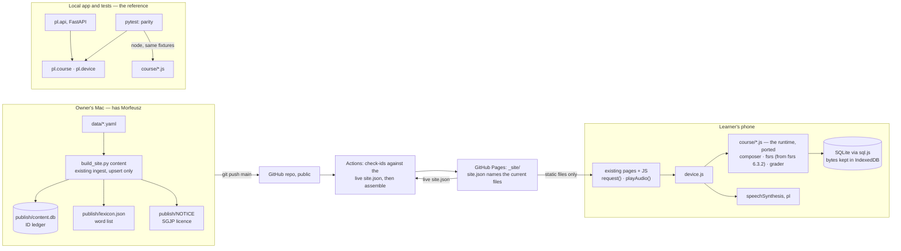

# Static mobile site — the course on a phone, from GitHub Pages

A learner with nothing but a phone browser opens a public URL and uses the whole course. Their
progress lives on their phone. Nothing runs server-side: GitHub Pages serves files, and the course's
runtime — ported to JavaScript and held to the Python by parity tests — runs in the browser.

Written 2026-09-18 against design v1 revision 4 ([`polish-learning-platform-v1.md`](polish-learning-platform-v1.md)).
Revision 2, 2026-09-19, takes in the first design review and the Pyodide spike.
Revision 3, 2026-09-23, takes in the second review: what is live on Pages, rather than the previous
commit, is what a deploy and a phone compare themselves against.
Revision 4, 2026-09-23, takes in phase 0. Python in the browser (Pyodide) took about a minute per
page open on an iPhone, so the phone now runs a JavaScript port of the course runtime, and the Python
stays the reference it is tested against.
Revision 5, 2026-09-23, takes in the third review. The phone's scheduler is a port of `fsrs` 6.3.2,
because the JavaScript FSRS library schedules differently; the parity comparison, transactions and
journey are now specified.
The implementation takes in the fourth review's three warnings, chosen by the owner: the journey
also compares the progress and grammar pages (W1), a test checks the committed ledger's schema (W2),
and the phone saves only after a request changed something (W3).

## Scope

- In:
  - Publish the course from this repo, made public, to GitHub Pages, deployed by GitHub Actions.
  - Port the course runtime to JavaScript for the phone: grading, scheduling (including `fsrs`
    6.3.2's scheduler), session composition, streak, lessons, progress. It reads and writes the same
    SQLite schema through `sql.js`.
  - Keep the Python as the reference: the local app, the content build, the tests, the journey
    simulator, and `pl.device` as the executable spec of the phone's API.
  - Parity tests that fail when the JavaScript and the Python differ.
  - One learner per phone; progress in IndexedDB.
  - Grading against a word list of Morfeusz's own analyses of the course's words.
  - Audio spoken by the phone's own Polish voice.
  - Content updates that keep every learner's progress, with a deploy check against renumbered ids.
  - The SGJP copyright notice and licence, published with the data.
  - Commit emails rewritten to the owner's GitHub noreply address before the first push.
- Out:
  - Python or Pyodide in the browser, and any server.
  - Third-party JavaScript other than `sql.js`.
  - Sync between devices, accounts, progress backup or export, offline caching.
  - Getting queued answers (criterion 18) from phones back to the owner, or keeping them across
    content updates.
  - Moving the laptop's existing progress to a phone.
  - Any change to grading, scheduling, session-composition or streak rules.
  - Removing or retiring published content.
  - A JavaScript build step, npm, or TypeScript.

## Acceptance Criteria

1. On iPhone (Safari, added to the Home Screen) and Android (Chrome), a learner opens the Pages URL,
   completes a session with feedback on every answer, finishes it, and opens the progress and
   grammar pages. No request reaches an application server.
2. On the owner's iPhone over Wi-Fi, the first question appears within 3 s of reopening the app or
   switching pages, and within 10 s on a first visit.
3. Progress survives closing the app and restarting the phone. Two phones keep independent progress.
   When the phone cannot save, the page shows an error instead of carrying on.
4. Deploying new content keeps every learner's cards, attempts, streak, unlocks and lessons read,
   and the new items become available to them. A deploy whose content file renumbers or drops an
   existing id fails before anything reaches Pages.
5. The golden corpus meets the gate with the phone's word list: ≥ 95% overall, ≥ 80% in every class.
   Every word in the built content gets the same analyses on the phone as from Morfeusz. For every
   case, the JavaScript grader gives the same diagnosis and the same message as the Python grading
   with the same word list.
6. A journey of at least 60 simulated days, replayed through the Python reference and the JavaScript
   runtime with a frozen clock, no FSRS fuzz and no shuffle, gives the same responses and the same
   learner rows.
   - The journey has skipped days (one, two, and more than the freezes cover), a day answered but not
     completed, extra rounds, typos and out-of-course words among its answers, and a content update
     halfway through.
   - Rows and responses are compared as values: JSON and timestamps parsed, FSRS floats within a
     relative 1e-12, everything else exactly, and FSRS's own `card_id` left out.
   - The JavaScript FSRS module matches `fsrs` 6.3.2 on scripted review sequences, by the same rule.
   - Day boundaries match the Python's in four timezones across daylight-saving changes, one of them
     changing its clocks at midnight.
7. On a phone with a Polish voice, dictation and option audio play at normal and slow speed. On a
   phone without one, dictation is not offered and options show no play button.
8. The local app (`uvicorn pl.api:app`) serves the same pages and API responses as before. The
   existing suite passes; only the two assertions that pin root-absolute URLs change, to the relative
   form (`tests/test_api.py` lines 208 and 548).
9. The published site carries the SGJP copyright notice and licence with its data, carries the
   `fsrs` and `sql.js` MIT notices with its code, and contains no Python and no Pyodide.
10. Every author and committer email in the pushed history is the owner's GitHub noreply address.

## Design Choices

### Why JavaScript

- `Verified:` Pyodide on WebKit is far too slow to start. Desktop Safari took 25.9 s to load it,
  where Chromium took 1.3 s on the same Mac. On the owner's iPhone one boot took about 28 s to load
  Pyodide and another 30 s for the imports, and every page open boots again.
- The owner chose a static site that is fast on iPhone. Of the three directions — a server, iPhone
  unsupported, or a port — only the port satisfies both.

### The Python stays the reference

- The local app, the content build, the tests and `journey_sim` are unchanged, and remain where the
  course's rules are written and measured.
- `pl/device.py` (phase 0) stays as the executable spec of the phone's API: installing content,
  creating the learner, and answering each call. The JavaScript must answer as it does.
- A rule change lands in the Python and the JavaScript together. The parity tests fail otherwise.

### The JavaScript runtime

- `pl/static/course/` holds one ES module per Python module it mirrors:
  - `tags.js`, `domain.js`, `classify.js`, `explain.js`, `schedule.js`, `streak.js`, `concepts.js`
    and `course.js`, each under its Python name;
  - `composer.js` for `pl/session.py`, which the Python already imports as `composer`;
  - `phone.js` for `pl/device.py` — named apart from the page scripts `static/session.js` and
    `static/device.js`;
  - `morph.js` for `pl.morph`'s word-list backend only;
  - `fsrs.js` for the part of `fsrs` 6.3.2 the app uses;
  - `db.js` and `clock.js`, standing in for SQLAlchemy and the clock.
- Every function carries a comment naming the Python function it mirrors.
- Each SQLAlchemy query becomes the same query in SQL, over the same tables.
  - Every query the Python leaves unordered gets an `ORDER BY` for the order SQLite returns it in:
    the primary key where it scans the table, the index's own order where a lookup walks one, and
    the group key after `GROUP BY`. Forms by lexeme come in surface order, which a lesson table's
    surfaces show, and prerequisites in prerequisite-id order. `Verified:` at least 12 composer
    loops iterate unordered queries, and the 53 statements captured in phase A have the same
    plans in the phone's SQLite (3.49.1) as in the Python's (3.53.1).
- Writes reach the database as they are made. SQLAlchemy flushes before every query and nothing
  turns that off, so each query sees what the Python's would, and new rows get the same ids.
- Where the Python relies on a Python rule, the port reproduces it: `str.casefold`, `str.split()`
  whitespace, `sum()` of floats (compensated since Python 3.12), and `round(x, 4)` on exact ties.
- One injected clock feeds every module, defaulting to the real one.
- `DateTime` columns and parameters use the Python's exact text, `YYYY-MM-DD HH:MM:SS.ffffff` in
  UTC with no zone, because SQL compares them as text. Dates use `YYYY-MM-DD`.
- Where the Python calls `round()`, the port rounds halves to the even neighbour, as Python does —
  in `fsrs`'s intervals and in the progress page's `round(retention, 4)`.
- Day boundaries use `Intl.DateTimeFormat` with the learner's IANA zone, mirroring `zoneinfo`.
- The session shuffle takes an injectable order, like the Python's.
- Grading analyses words from `lexicon.json`, as `pl.morph`'s word-list backend does.
- Lessons read `data/concepts.yaml`, shipped as JSON.

### FSRS, ported from `fsrs` 6.3.2

- `Verified:` `ts-fsrs` 5.4.2 cannot stand in. It counts elapsed time in UTC calendar days where
  `fsrs` counts whole 24-hour periods (`scheduler.py:269`), which changes the formula for reviews
  less than a day apart that cross UTC midnight. It also rounds stability, difficulty and
  retrievability to 8 decimals, where `fsrs` rounds only intervals.
- `fsrs.js` ports what `pl.schedule` uses:
  - `Scheduler` with its defaults: 21 parameters, retention 0.9, learning steps 1 min and 10 min,
    relearning step 10 min, maximum interval 36,500 days, fuzz on;
  - `review_card`, and `get_card_retrievability`;
  - `Card`, with `to_dict()` and `from_dict()`;
  - `Rating` and `State`.
- Not ported: `reschedule_card`, review logs, and the optimizer.
- Elapsed time is counted in whole 24-hour periods, and rounding happens only where the library
  rounds, as described above.
- In production, fuzz uses the library's own ranges, drawn with `Math.random`.
- The module carries `fsrs`'s MIT notice ("Copyright (c) 2022 Open Spaced Repetition"), published
  with it.

### Progress on the phone

- The database is SQLite, in memory, through `sql.js`.
- At start-up, `device.js` restores the database's bytes from IndexedDB.
- Each request runs in one transaction. It commits exactly where the Python commits:
  - `course._user`, when it creates the learner;
  - `submit`, after grading;
  - `evaluate_unlocks`, then `record_activity`, in `complete`;
  - `mark_read`.
  
  Everything else rolls back — including a streak row `streak._streak` flushes during a GET, and an
  attempt flushed before a refusal in `submit`.
- After the request finishes, `device.js` saves the database's bytes and the installed content hash
  to IndexedDB in one transaction, and only then resolves the page's call.
  - It saves only when SQLite's `total_changes()` moved during the request (W3). A read whose flush
    was rolled back may still save, which is harmless.
  - `Verified:` `sql.js`'s `export()` closes and reopens the database, freeing every prepared
    statement. So a save never happens mid-transaction, and no statement or pragma is kept across
    one.
  - A failed save rejects with a message the page shows. The change stays in memory, and the next
    successful save stores it.
- Each page holds its own copy of the database. A page the browser brings back from its
  back/forward cache reloads first, so it never saves a copy older than the one saved since.
- A start-up that fails is started again by the page's next call, so its "Try again" can recover
  from a download that failed once.
- One learner per phone, created with the phone's IANA timezone, or UTC for a zone the browser does
  not know.
- `device.js` calls `navigator.storage.persist()`.
- `pl/static/manifest.webmanifest` makes the site a Home Screen web app on iPhone. It sets
  `display: standalone`, and `start_url` and `scope` to `"../"`.

### Installing and updating content on the phone

- The same rules as `pl.device.install`, ported:
  - It runs whenever the content file that `site.json` names differs from the one recorded.
  - The shipped file is opened as a second `sql.js` database.
  - Each content table is dropped and recreated from the shipped file's own definition and indexes,
    and its rows are copied with their ids, in one transaction.
  - Learner tables are never read from the shipped file. So the learner the build creates never
    reaches a phone, and queued answers go with the content table they sit in.
- Learner tables are created, or given missing nullable columns, from the shipped file's
  definitions. The ledger is built by the Python models, so they stay the one schema.
- When the recorded hash already matches, the content file is not fetched.

### Parity tests

- `tests/js/*.test.mjs` run under Node's built-in runner (`node --test`), with no npm. They unit-test
  the ported modules.
- `tests/test_parity.py`, run by `uv run pytest`, compares by one rule: JSON and timestamps parsed,
  FSRS floats within a relative 1e-12, everything else exactly, and FSRS's `card_id` left out.
- **FSRS.** Scripted review sequences go through `fsrs` 6.3.2 with fuzz off and through `fsrs.js`:
  - learning steps, and "Hard" on the first step;
  - lapses;
  - reviews less than 24 h apart that cross UTC midnight;
  - long gaps;
  - an interval that lands on a half.
- **Journey.**
  - The Python clock is frozen by substituting `datetime` in `pl.session`, `pl.schedule`,
    `pl.course`, `pl.concepts` and `pl.content.ingest`, as `journey_sim` does. FSRS fuzz is off, and
    the shuffle keeps its order.
  - An older ledger, with one noun missing, is installed through `pl.device`. The newer one is
    installed on day 30. The missing noun is one no lesson's table names, since the content
    build refuses a ledger a lesson cannot be rendered from.
  - At least 60 days are driven. Most days request the session, read any lesson, answer every item
    and complete the session. Some days are skipped (one, two, and more than the freezes cover), one
    is answered but not completed, and some take an extra round.
  - Answers are correct 85% of the time, from a seeded generator. Wrong answers come mostly from
    `journey_sim.wrong_answer`, with some typos, out-of-course words and sentences in the wrong
    word order, which queue answers for review. An aspect choice goes wrong by the other aspect.
    Dictation, served rarely, goes wrong half the time, by Polish letters typed as ASCII, so its
    strict spelling rule is compared.
  - One day after a missed day is completed short of the goal, so the absence is reckoned twice
    and must be paid for once.
  - At least weekly, the journey also requests the graph, the concept list and every concept page
    (W1).
  - Every request, the clock at each one, and every response are recorded.
  - `tests/js/replay.mjs` replays them in Node from the same starting database and ledgers, and the
    responses and learner rows are compared.
- **Transactions.** A GET that would create a missing streak row, and a submit refused after its
  attempt is flushed, leave the same rows on both sides.
- **Golden corpus.** Every case goes through the Python grading with the word list
  (`morph.use_lexicon`) and through the JavaScript grader, with paradigms exported from Morfeusz at
  test time. Diagnoses and messages must match.
- **Day boundaries.** Instants across daylight-saving changes, in Europe/Warsaw,
  America/Los_Angeles, Pacific/Auckland, and America/Havana.
  - `Assumption:` Havana's clocks change at midnight. It is checked against tzdata when the test is
    written, and replaced by another such zone if not.
- With no `node` on the machine, the parity tests fail rather than skip: drift must not pass
  unnoticed.
- `tests/test_device.py` keeps testing `pl.device`, the reference.

### The content ledger and its guards

- Learner rows point at content by id: `card.form_id`, `sense_id`, `pattern_id`, `attempt.item_id`,
  `node_id`. Ids follow build order.
- `publish/content.db` is committed and is the ID ledger. `scripts/build_site.py content`:
  - runs the existing `python -m pl.content.ingest` against it via `DATABASE_URL`;
  - never passes `--drop-unanswered-stale`;
  - refuses to create a ledger without `--init`;
  - then writes `publish/lexicon.json` and `publish/NOTICE`.
  - It runs on the Mac, where Morfeusz works.
- `build_site.py check-ids OLD NEW` fails if any id in the old ledger is missing from the new one, or
  now names a different row. "The same row" is judged by a natural key per table:
  - lexeme: lemma
  - form: lemma + morph_tag
  - sense: lemma
  - pattern: rule_key + paradigm_class
  - node: key
  - item: exercise_type + prompt + expected_answer
- `Verified:` the content build matches existing items by that same triple, and edits only an item's
  `node_id` and `gloss` in place. So a routine content edit passes the check.
- Before deploying, the workflow runs `check-ids` against the content file learners actually have:
  - it fetches the live `site.json` from the Pages URL, with a query no cache has seen, then the
    content file that `site.json` names;
  - a 404 on `site.json` means nothing is deployed yet, and the check passes;
  - any other failure fails the deploy.
- `content` also runs `check-ids` against the ledger it started from, before it writes anything.
- `tests/test_site.py` checks that the committed ledger has every table and column the models
  declare, since phones take their learner tables from it (W2).
- `publish/NOTICE` holds Morfeusz's `dict_copyright()` text, which carries the SGJP copyright and
  licence. `assemble` publishes it as `NOTICE.txt`.

### The site

- `.github/workflows/pages.yml` runs on a push to `main`. It:
  - runs `check-ids` against the live `site.json`;
  - runs `build_site.py assemble`, with PyYAML as its only package, so CI needs no Morfeusz;
  - deploys `_site/` with GitHub's Pages actions.
  - It takes the base path and the site's URL from `actions/configure-pages`.
- `_site/` holds:
  - `index.html`, `progress/index.html` and `grammar/index.html`, plus `grammar/<key>/index.html`
    for every key in `data/concepts.yaml`, because Pages has no routing;
  - `static/`: the page scripts, `device.js` and the manifest, plus `NOTICE.txt`. Pages ask for the
    scripts and the stylesheet by the digest of `static/` (`static/common.js?v=<digest>`): Pages
    ignores the query and a browser caches each address apart, so a fresh page never runs an older
    deploy's cached scripts. The manifest keeps one address;
  - `app.<hash>/`: the runtime modules, `sql.js` and its licence, in a folder named by the hash of
    its contents, so one deploy's modules never import another's;
  - `content.<hash>.db`, `lexicon.<hash>.json` and `concepts.<hash>.json`;
  - `site.json`, at a fixed name, listing the current names of the app folder and those three files.
- At start-up, `device.js` fetches `site.json` with `cache: "no-store"` and a unique query:
  - if the names differ from the ones in its own page, the page is stale, and it reloads once;
  - the phone only ever installs the content file `site.json` names;
  - if the fetch fails, it goes on with its page's own names.
- A file that has gone from the server (a 404) also triggers the one reload.
- `sql.js` 1.14.2 is copied into `pl/static/vendor/` with its MIT licence, and served by the site.
  Nothing is loaded from a CDN at runtime, and the tests import the same files.
- Templates and page scripts use relative URLs under `<base href="/">`. `assemble` sets the base to
  the Pages path and injects `device.js` and the manifest link.
- `grammar.js` reads the concept key relative to the base, and tolerates a trailing slash.

### Publishing this repo

- `Verified:` the 43 commits contain no secrets. `main` carries two personal email addresses, and
  every `pat/*` branch is merged into it.
- Before the first push, the owner rewrites `main`'s author and committer emails to their GitHub
  noreply address. They do it with `git filter-repo --mailmap` in a fresh clone, and push `main`
  from there. Only `main` is pushed.
- Then the working repo:
  - resets `main` to the pushed one;
  - removes the merged `pat/*` branches and their worktrees;
  - keeps the `review/*` snapshots local.
- This repo's `user.email` becomes the noreply address, and GitHub's "Block command line pushes that
  expose my email" setting is turned on.

### Audio from the phone's voice

- `pl.audio.use_device_voice(bool)` sets a flag that `available()` checks before its cached probe,
  and clears that cache. The JavaScript mirrors the flag from the phone's voice list.
- `speech_text(item_id, index=None)` keeps the guards of today's audio routes: listening items only,
  and options by position. `pl.course` and the JavaScript runtime both provide it, and the local
  server's audio routes take their text from it, so the rule exists once in the Python.
  - On a phone, `GET /api/audio/{item_id}` and `GET /api/audio/{item_id}/option/{index}` answer with
    it: `{"text": ...}`, not a sound. `pl.device` routes them as `phone.js` does.
  - Like the audio routes, it refuses (503) when there is no voice to speak.
- `common.js` gains `playAudio(url)`, which is today's `new Audio(url).play()`. `session.js`'s two
  play buttons call it. `device.js` replaces it with `speechSynthesis`: a `pl` voice, rate 1.0 for
  normal and 0.5 for slow.
  - `Verified:` rate 0.5, not 0.8, is the local server's 0.8× speed. Browsers map the rate onto the
    platform's own non-linearly: on the owner's iPhone, 0.8 took no longer than 1.0, and 0.5 took
    1.28 times as long (1.27 in Chrome on the Mac). The owner chose 0.5 by ear.
  - Nothing is cancelled before speaking: a tap while speech plays is queued after it. `Verified:`
    on the owner's iPhone, cancelling an utterance mid-sentence silenced the next three.
- The speech text is fetched synchronously inside the tap handler. `Assumption:` iOS starts speech
  only from a user gesture.
- `device.js` looks for a voice whose language is `pl` while the rest of start-up runs, waiting at
  most a second for a browser that lists its voices late.
- `Verified:` the macOS licence forbids publishing clips made with its system voices, so nothing
  from `audio-cache/` is published.

### Accepted reversals of design v1

- Grading runs on the phone, and the answer key is public in the content file. §"Offline
  contradicts server-side grading" called this a non-issue for path A.
- Queued answers (criterion 18) stay on each phone until its next content update. The owner does not
  see them.
- The course logic, and the part of `fsrs` the app uses, exist twice. Design v1 rejected porting
  FSRS as "strictly worse". The phone ports it anyway, because the maintained JavaScript library
  schedules differently, and the parity tests hold the port to `fsrs` 6.3.2 and the rest of the
  runtime to the Python.

### Phases

- **Done: phase 0** (branch `pat/static-mobile-site`, not yet committed):
  - the `pl.course` split, `pl.device`, and the word-list backend;
  - the ledger, its guards, `site.json` and `assemble`;
  - relative URLs, the manifest and the workflow.
  - Its Pyodide runtime is what revision 4 replaced.
- **Done: phase A: iPhone check, throwaway, in the scratchpad.** It left room inside criterion 2.
  - Capture the SQL the Python composer issues for one day's session on a database after 90
    simulated days, using a SQLAlchemy `before_cursor_execute` hook.
  - A page loads `sql.js`, restores and saves that database through IndexedDB, installs the content
    file, and replays exactly that SQL.
  - The owner opens it on their iPhone over Wi-Fi.
  - The port goes ahead only if its numbers leave room inside criterion 2.
- **Done: phase B: grading and FSRS.**
  - `tags.js`, `domain.js`, `classify.js`, `explain.js`, `morph.js` and `fsrs.js`, with the
    datetime half of `clock.js`, which `fsrs.js` needs.
  - Golden-corpus parity (criterion 5), and FSRS parity (criterion 6).
- **Done: phase C: the rest of the runtime.**
  - `schedule.js`, `composer.js`, `streak.js`, `concepts.js`, `course.js`, `phone.js`, `db.js` and
    `clock.js`, with `sql.js` vendored for the tests.
  - Journey, transaction and timezone parity (criterion 6), the page routes in the journey (W1),
    and the committed ledger's schema test (W2).
- **Done: phase D: switch the site.**
  - `device.js` boots the JavaScript runtime and saves only after a change (W3), `assemble` ships
    the app folder and the lessons' JSON, and the Pyodide pieces leave the site.
  - Timed on the iPhone against criterion 2.
  - Covers criteria 1–4, 8 and 9. The history rewrite comes before the first push (criterion 10).
- **Done: phase E: the phone's voice** (criterion 7). Checked on a phone by hand: see "Validation
  Required".

## Estimated Footprint

- Already changed in phase 0: 12 existing files, and 11 added. See the branch.
- Existing files changed by revisions 4–5: 4.
  - `pl/static/device.js` (boots the JavaScript runtime instead of Pyodide)
  - `scripts/build_site.py` (the app folder and the lessons' JSON; no zip or wheel)
  - `tests/test_site.py`
  - `README.md` (the layout section)
- Phase E changes, as planned since revision 2: `pl/audio.py`, `pl/course.py`, `pl/static/common.js`,
  `pl/static/session.js` and `tests/test_audio.py`.
- Actual, at the end of phase E:
  - 22 files added, as estimated: the 14 modules, `sql.js` with its licence, three unit-test files
    and `replay.mjs`, and `tests/test_parity.py`.
  - Beyond the lists here, in files this branch added: `pl/device.py` routes the phone's speech
    text, as `phone.js` does, and `tests/test_device.py` builds an older ledger a lesson can still
    be rendered from and tests the speech routes.
- Files added: about 22.
  - `pl/static/course/`: 14 modules, about 4,000 lines, `fsrs.js` about 500 of them
  - `pl/static/vendor/`: `sql-wasm.js`, `sql-wasm.wasm` and `sql.js`'s licence
  - `tests/js/`: the unit tests and `replay.mjs`
  - `tests/test_parity.py`
- Files deleted: 0. `pl/device.py` stays as the reference.
- New dependencies:
  - `sql.js` 1.14.2, MIT, copied into the repo.
  - Node, for the tests only. It is on the owner's Mac (23.11).
- Dependencies removed: Pyodide and its packages at runtime, and the `fsrs` wheel download.
- New persistent state: the phone's database bytes and installed content hash in IndexedDB; the
  committed ledger, as before.

## Optional hardening

- None selected. Candidates, for later:
  - Running the suite, parity included, in CI before deploying.
  - A progress backup file.
  - Offline use through a service worker.
  - Exporting queued answers to the owner.
  - A prompt to add the site to the Home Screen on iOS.
  - A note that the iPhone's silent switch mutes the voice.
  - A single-tab lock: two open tabs would each hold a copy of the database, and the last to save
    wins.
  - Failing a deploy whose `data/*.yaml` changed after the ledger was built.
  - Failing a deploy whose ledger lacks a column the models declare.
  - Manifest icons.
  - Retiring content.

## Validation Performed

- Phase 0, implemented on `pat/static-mobile-site`:
  - The suite passed: 564 tests, the 521 existing plus 43 new.
  - In Chromium the static site booted, graded, kept progress across a reload, and rendered the
    progress, grammar and concept pages.
  - It worked under a repository path, requested nothing from PyPI, and reloaded a stale page once
    before installing only the newer content.
  - The local app was unchanged, including the option play buttons.
- WebKit, measured with a boot instrumented to report each phase to the server's log:
  - Desktop Safari on the Mac:
    - loading Pyodide 25.9 s;
    - packages 11.2 s;
    - imports 184 s (with the tab in the background) — SQLAlchemy alone 105 s;
    - first request 8.1 s.
  - Chromium, same page and Mac: 3.7 s to the first answered request.
  - The owner's iPhone: about 28 s to load Pyodide and 30 s for the imports on the boot that
    completed, after six page loads in one visit. Whether those were reloads by hand or by iOS was
    not established.
- Phase A, on the owner's iPhone (iOS 18.7) over Wi-Fi, replaying the composer's captured SQL
  through `sql.js` with the database restored from IndexedDB:
  - After 90 simulated days (1.04 MB): session ready 0.3–0.5 s after a reopen; progress page
    1.4–2.7 s; saving an answer 8–42 ms; installing the content file about 0.5 s (3.0 s once).
  - After 365 days (1.55 MB, 7,090 reviews): session ready 0.7 s, on a first visit too before
    downloads; progress page 3.8–4.2 s; saving an answer 13 ms.
  - Identical runs varied up to 2× on the phone. Desktop Safari was no faster (4.9 s for the
    one-year progress page).
  - The one-year progress page is over 3 s because of two unindexed lookups run once per card:
    `_card_is_mastered`'s review count (476 times) and `node_mastery`'s card lookup (621 times).
    Indexes on `review.card_id`, `card.sense_id`, `card.form_id` and `card.pattern_id` cut them
    tenfold in the phone's SQLite, and none of the 2,071 captured statements returned other rows
    or another order. On 2026-09-25 the owner accepted the slower progress page instead, and the
    schema stays as it is.
- `sql.js`'s `new SQL.Database(bytes)` keeps `bytes` as the database file and writes into it. A
  buffer that is still in use elsewhere has to be copied first.
- Phase B, on `pat/static-mobile-site`:
  - Graded with the published word list, the JavaScript gives the Python's diagnosis, message,
    observed form and deciding attribute for all 65 golden cases and the 10 sentence cases. All
    853 words of the built content get Morfeusz's analyses from it.
  - `fsrs.js` matches `fsrs` 6.3.2 on 12 scripted sequences, within 1e-12, and on one with fuzz
    on and scripted draws.
  - `casefold` is Python's: measured over every code point, it differs only on 27 characters that
    Unicode 16 added after Python's Unicode 15.0. `str.split()` whitespace differs from
    JavaScript's `\s` by six characters, and the port uses Python's.
  - The tests catch drift. Rounding halves up, counting days to the nearest, narrowing the fuzz
    range, changing a message's punctuation, the attempt distance and the candidate tie-break each
    failed them. A formula perturbed by 1e-10 failed them once a sequence reached the short-term
    bound of the forgetting stability.
  - The suite passed: 569 tests.
- Phase C, on `pat/static-mobile-site`:
  - A 64-day journey through `pl.device` and through the port gives the same 1,345 responses and
    the same learner rows. It serves all six exercise types, reaches 11 of the 12 error classes
    (`GENDER_AGREEMENT` has no item in the content), reads five lessons, unlocks ten nodes, spends
    and earns freezes, installs the newer ledger on day 30, and opens the progress and grammar
    pages weekly. A GET that would create a missing streak row, and a submit refused after its
    attempt was flushed, leave the same rows on both sides.
  - Today's date and the midnights either side of it match the Python's at 5,828 instants in
    Europe/Warsaw, America/Los_Angeles, Pacific/Auckland and America/Havana, most of them within
    30 hours of a clock change.
  - The tests catch drift. Of twelve deliberate changes to the port, nine failed the journey:
    the debt tolerance, the openers-first pass, the rotation among equals, the freeze interval,
    paying for an absence twice, the early-review cooldown, dictation's strict spelling, a
    request that commits instead of rolling back, and a boolean accepted as an id. The other
    three cannot show with this content: no lexeme has two senses, no lesson table cell two
    surfaces, and the populations are already in sorted order.
  - The committed ledger's schema test fails when a model column is missing from it.
  - `sql.js` 1.14.2 comes from the npm registry, its tarball matching the registry's sha512; its
    two files are byte-identical to the ones phase A measured.
  - The port is 3,376 lines in 14 modules, `fsrs.js` 434 of them.
  - The suite passed: 572 tests, and 22 JavaScript unit tests.
- Phase D, on `pat/static-mobile-site`, with the assembled site served from the Mac:
  - On the owner's iPhone (iOS 18.7, Safari, Wi-Fi), measured from the page's navigation to its
    first answer on screen: a first visit 1.1 s, with 1.9 MB downloaded, the content installed
    and the database saved; the progress page 0.26 s; back to the session 0.17 s; reopening
    0.11 s; an extra round 0.24 s. Each answer took 26–32 ms, its save included.
  - In Chromium the site started, served the first lesson, graded and saved an answer, kept it
    across a reload without fetching the content file again, and rendered the progress page,
    the grammar index, a lesson page and an extra round.
  - The site holds no Python, Pyodide, zip or wheel, loads nothing from another server, and
    carries `sql.js`'s licence and `fsrs`'s notice with the code.
- Phase E, on `pat/static-mobile-site`:
  - In Chromium on the Mac, which lists macOS's Polish voice (Zosia, pl-PL): the session's options
    carried play buttons; a tap on Play spoke a dictation sentence at rate 1.0 and speech was
    under way at once; Slower spoke it at the slow rate; an option's button spoke that option.
  - On the owner's iPhone (iOS 18.7, Safari) the voice is Zosia, speech starts from a tap, and
    options are spoken. Slower at rate 0.8 sounded exactly like Play, which the timings bore out,
    so the slow rate became 0.5: Play then took 1.65 s and Slower 2.00 s, and it sounds slower.
  - With the iPhone's silent switch on, nothing is heard: the utterance runs its course muted.
  - In Chromium, Slower tapped while Play was speaking was queued after it and played.
  - Without a voice, no item carries sound and dictation is not served; the speech text refuses
    with 503. With one, a listening item's sentence and an option by position are spoken, and
    nothing else: tested through `pl.device` and through `phone.js`.
  - The journey asks what every play button it meets would say, and the two sides agree.
  - The suite passed: 574 tests, and 24 JavaScript unit tests.
- The two-pass review of the change (2026-09-25) found nothing Required. The owner had its five
  Recommended findings fixed:
  - P2-F1: a page restored from the back/forward cache reloads before it can save. Checked in
    Chromium with a restored-page event; its own Back gave a fresh load, so Safari is listed below.
  - P1-F1: page scripts carry the deploy's `static/` digest. A test changes a script and sees every
    page's version change, while the app folder's name does not.
  - P1-F4: a failed start-up is retried by the next call. Checked in Chromium: with the word list
    missing, start-up failed; once it was back, "Try again" served the session without a reload.
  - P1-F2: the local audio routes take their text from `course.speech_text`; `test_api`'s audio
    tests pass unchanged.
  - P2-F3: `phone.test.mjs` adds a nullable learner column on a content update, keeping the rows,
    and refuses a NOT NULL one, changing nothing. Both tests fail when those branches are broken.
- `ts-fsrs` 5.4.2 against `fsrs` 6.3.2, from both libraries' source:
  - `ts-fsrs` counts elapsed days as UTC calendar days (`dateDiffInDays`); `fsrs` counts whole
    24-hour periods (`timedelta.days`, `scheduler.py:269`).
  - `ts-fsrs` rounds to 8 decimals at 11 places; `fsrs` rounds only intervals (`scheduler.py:687`,
    and the fuzz range).
  - Their defaults match: retention 0.9, maximum interval 36,500, learning steps 1 min and 10 min,
    relearning 10 min, fuzz on.
- What `pl` uses of `fsrs` 6.3.2: `Card` with `to_dict`/`from_dict`, the default `Scheduler`, its
  `review_card` and `get_card_retrievability`, `Rating` and `State`. That is about 500 lines of the
  library. MIT, "Copyright (c) 2022 Open Spaced Repetition".
- `sql.js` 1.14.2 bundles SQLite 3.49.1; the Python uses 3.53.1. Its `export()` frees every prepared
  statement and function, closes the database and reopens it.
- `sql.js` 1.14.2 is 643 KB of WebAssembly plus 45 KB of JavaScript, MIT.
- Row formats, from the local database:
  - timestamps `YYYY-MM-DD HH:MM:SS.ffffff`, in UTC, with no zone;
  - dates `YYYY-MM-DD`;
  - card state as `fsrs`'s `to_dict()` JSON.
- The clock is read in `pl.course`, `pl.session`, `pl.schedule`, `pl.concepts` and
  `pl.content.ingest`. FSRS is handed explicit datetimes; only its `card_id` comes from the real
  clock.
- Transactions: the Python commits in `course._user`, `submit`, `evaluate_unlocks`,
  `record_activity` and `mark_read`. `streak._streak` flushes a row during GET requests that is
  rolled back when the session closes (`pl/streak.py:40-46`).
- `journey_sim.wrong_answer(db, item, rng)` always picks another form of the same word.
- The streak's absence rules (`_apply_absence`, `MAX_FREEZES` 2, `DAYS_PER_FREEZE` 10) run only
  after skipped days.
- The runtime to port is about 3,650 lines, with about 107 queries. About 4,500 lines of Python tests
  pin its behaviour.
- The word list: 3,344 surfaces, 243 KB. All 845 course tokens get Morfeusz's own analyses, and the
  golden corpus scores 63/65 with it, against 64/65 with Morfeusz.
- The ledger:
  - `check-ids` compares natural keys;
  - the content build matches items and patterns by those keys;
  - `main` has no merge commits, which is why the deploy check compares against the live site.
- Pages sends `cache-control: max-age=600` and ignores query strings.
- Morfeusz's licence (2-clause BSD) requires the notice with redistribution in binary form.
- Git history: 43 commits and no secrets. Two personal addresses appear only in author and committer
  fields. `git-filter-repo` is not installed.
- Simplicity checkpoints:
  - 2026-09-18: 14 changed, 9 added, approved.
  - 2026-09-19: revision 2, 14 changed and 11 added, approved.
  - 2026-09-23: revision 3, 15 changed and 11 added.
  - 2026-09-23: revision 4, the JavaScript port (about 21 files added, 4 changed), approved.
  - 2026-09-23: revision 5, `ts-fsrs` replaced by a port of `fsrs` 6.3.2 (about 22 added), chosen by
    the owner.

## Validation Required

- [x] Phase A on the owner's iPhone: `sql.js` start-up, restoring and saving the database through
      IndexedDB, installing the content file, and replaying one day's captured composer SQL —
      against criterion 2. See "Validation Performed".
- [x] Phase D on the owner's iPhone: first visit, reopening, a page switch, "Another round" and an
      answer, against criterion 2. See "Validation Performed".
- [x] A 365-day learner database: a page open and one answer's save on the iPhone. The progress
      page takes about 4 s at one year, accepted by the owner.
- [x] America/Havana's clocks change at midnight in tzdata; otherwise another such zone is chosen.
      In 2026 they skip from 00:00 to 01:00 on 8 March and repeat 00:00 on 1 November, in the
      Mac's tzdata and in Node's (2025a).
- [ ] Progress survives a tab close, switching apps and a phone restart, in an iPhone Home Screen app
      and in Android Chrome.
- [ ] Whether progress started in a Safari tab carries into the Home Screen app on iOS.
- [ ] Installed from the progress page, the Home Screen app stays in the app when opening the session.
- [ ] A failed save shows an error. Force one from Safari's Web Inspector.
- [ ] On the iPhone, swiping back to a session page after answering on a newer one reloads it, and
      the newer answers are kept.
- [ ] On the real Pages site, a stale page after a deploy reloads once and shows no error.
- [ ] A real deploy of changed content, applied to a phone that already has progress.
- [x] A Polish `speechSynthesis` voice exists on the owner's iPhone. Speech starts from a tap, the
      slow rate is audibly slower, and the silent switch mutes it. See "Validation Performed".
- [ ] The same on an Android phone, in Chrome.
- [ ] Relative links and `location.assign('./?more=1')` resolve against `<base href>` on Pages.
- [ ] On the pushed `main`, `git log --format='%ae%n%ce' | sort -u` shows only the noreply address,
      and neither personal address appears in any file or commit message.
- [ ] A push that fast-forwards two commits, the first of which renumbers the ledger, fails
      `check-ids`. So does a push made on top of a commit whose check failed.
- [ ] The first deploy passes `check-ids` on a 404 for `site.json`.
