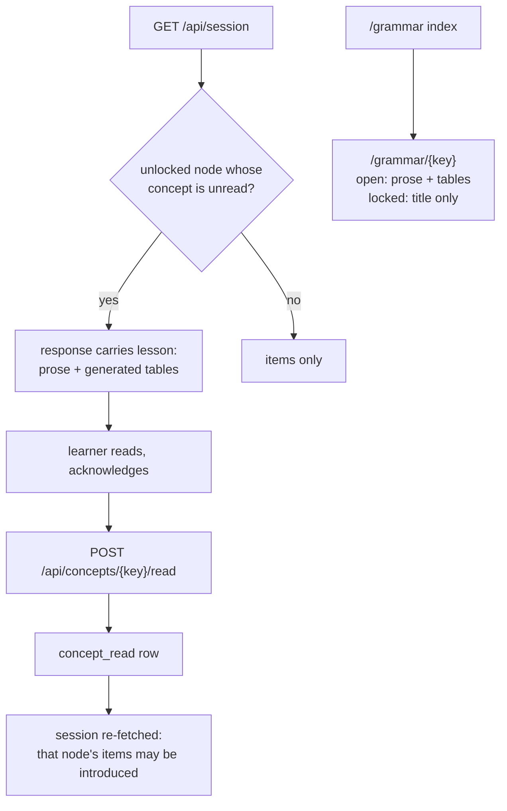

# The teaching surface: concepts, lessons, and a grammar the learner can read

The course currently teaches by correction. A wrong answer is diagnosed
precisely — `"You used the nominative. This slot needs the genitive: kawy."` —
and that is the product's strongest feature. But a learner who answers correctly
is never told *why* an ending changes, and the one sentence of explanation they
do see appears once, at the unlock moment, and is then unreachable.

This document designs the other half: the concept is taught before it is
drilled, in the terms Polish schooling uses — *odmiana przez przypadki*, the
case and its questions, the endings in a table — and stays readable afterwards.

Design of record: [`polish-learning-platform-v1.md`](polish-learning-platform-v1.md).
This document extends it; nothing here revises a decision recorded there.

**Revised after interrogation.** Two defects in the first draft are fixed below
and recorded rather than quietly corrected: the new table would never have
reached the running app, and the reconciliation rule would have skipped the first
grammar lesson for every new learner.

## Scope

- In: a **concept** entity — authored prose plus generated declension tables —
  keyed independently of the node graph, since one concept spans several nodes.
- In: a lesson is **shown before the node's first question** and must be
  acknowledged; the node introduces no new items until it is.
- In: a `/grammar` index and a page per concept, readable after the concept
  opens.
- In: six concepts, covering `V01`–`N08` — everything a ninety-day learner
  reaches (`Verified:` N08 opened on 11 of 12 seeds at 85% accuracy, N09 and N10
  on none within 150 days).
- In: `scripts/journey_sim.py` models the learner reading a lesson.
- In: the content build creates the table, validates the concepts, and reconciles
  a learner who was already mid-course.
- Out: the later cases (`N09`–`N12`). Their concepts follow in a second pass, on
  the same mechanism.
- Out: exercises *inside* a lesson, audio in a lesson, and any change to how
  items are graded or scheduled.
- Out: reordering the course. Whether three weeks of vocabulary before the first
  grammar is the right opening is a separate question, recorded below.

## Acceptance Criteria

1. A concept declares the node that introduces it and the nodes that also teach
   it; `data/concepts.yaml` holds prose, case questions and table specifications.
2. The content build refuses a concept whose introducing node does not exist, and
   refuses a table cell that is not a real form of its lexeme — the assertion
   criterion 16 already makes for items, applied to tables.
3. A table shows syncretism rather than hiding it: `kot`'s `gen.acc` cell appears
   in both the genitive and accusative rows, which is what "the accusative
   borrows the genitive" *means*.
4. `GET /api/session` carries at most one unread lesson: the first unread concept
   among unlocked nodes, in node order. *Amended 2026-09-18: first written as
   "for the node the session would otherwise introduce from next". §Design
   Choices settled on node order and the wording was not updated; the two cannot
   differ in practice, because every open lesson is read, one after another,
   before the node behind it introduces anything.*
5. The introduction segment offers no new item from a node whose concept is
   unread. Debt and remediation are unaffected: a card the learner already holds
   still comes back.
6. `POST /api/concepts/{key}/read` records the reading; the lesson is not offered
   again, and the learner may answer that node's items **in the same session**.
7. `GET /grammar` lists every concept with its state; an open concept's page
   renders its prose and tables, and a locked one shows its title only — no
   prose, in the page or in the API behind it.
8. A learner whose nodes were unlocked before this shipped has those concepts
   recorded as read by the content build, and loses no material.
9. `journey_sim` reads each lesson the day it is offered, and the pacing floors
   do not regress: nodes opened, items met **and streak-advancing days** over
   twelve seeds stay within the range measured today.
10. Reading a lesson does not count toward the daily goal, and writes no card,
    review or attempt.

**Status — audited 2026-09-18: all ten closed.** 1–2
`test_the_build_accepts_the_concepts_as_authored`,
`test_a_concept_naming_a_node_the_graph_lacks_is_refused`,
`test_a_table_cell_that_is_not_a_real_form_is_refused`; 3
`test_the_animacy_table_shows_one_form_in_two_rows`; 4 and 6
`test_a_session_carries_one_lesson_until_it_is_acknowledged`,
`test_one_lesson_is_offered_at_a_time_in_node_order`; 5 and 6
`test_an_unread_lesson_withholds_new_material_and_nothing_else`; 7
`test_a_concept_the_learner_has_not_reached_carries_no_prose`; 8
`test_the_build_reconciles_a_learner_who_was_mid_course`; 9 by measurement,
twelve seeds × ninety days, §Validation Performed; 10
`test_a_session_carries_one_lesson_until_it_is_acknowledged`, which counts the
attempt, review and card rows a reading leaves behind.

## Design Choices

- **The unit is a concept, not a node.** The genitive is three nodes and one
  idea; the case system spans every node. A concept names `introduced_by` (one
  node) and `also_taught_in` (any number), so `N09` and `N10` point at the
  genitive concept `N08` introduced rather than re-explaining it.
- **Six concepts in scope**, each introduced by the node that first needs it:

  | concept | introduced by | also taught in | what it teaches |
  |---|---|---|---|
  | `VOCAB_GENDER` | V01 | — | words carry gender, and gender drives every ending that follows |
  | `CASES` | N01 | N02 | *odmiana przez przypadki*: the seven cases, their questions, why an ending changes at all |
  | `ACCUSATIVE` | N03 | N04 | the direct object, and the three endings gender decides |
  | `ANIMACY` | N05 | — | why a living masculine borrows the genitive |
  | `INSTRUMENTAL` | N07 | — | *with what?* and *as what?*, and the most regular endings in the language |
  | `GENITIVE` | N08 | N09, N10 | negation, possession and government — one case, three jobs |

- **Prose is authored; tables are generated.** The endings come from the stored
  paradigm, so a table cannot be wrong unless SGJP is — the same guarantee the
  items carry. The *why* cannot be derived from a paradigm, so it is written, and
  it is the part that wants the owner's review.
- **A table specification names a lexeme and the cases to show**, and the
  renderer reads `form.morph_tag` through `pl.tags.parse`. Containment, not
  equality: `kota` is tagged `subst:sg:gen.acc:m2`, so it lands in two rows — see
  criterion 3.
- **Case questions are authored per case** (`kto? co?`, `kogo? czego?`, …) and
  render beside each row, with the English question beneath (`gloss` in the
  `cases:` map — *who? what?*). This is how the case is named in a Polish
  classroom, and the questions are what make a case identifiable in a sentence;
  the English was added at the owner's review, because a beginner cannot yet
  read the Polish ones. The build checks every case in the map for all four
  fields, not only the cases some table happens to show.
- **Only a section body is Markdown.** A title, summary, heading or caption is
  escaped and shown as typed, and the build refuses a backtick or an asterisk
  in any of them: eight captions reached the page with literal backticks before
  the owner caught them.
- **The gate is on introduction only.** `build_session`'s introduction segment
  skips a node whose concept is unread; the debt and remediation segments never
  consult it. A learner who ignores a lesson loses new material from that node
  and keeps everything they have already met — the difference between a gate and
  a punishment.
- **One lesson at a time**, the first unread concept among unlocked nodes in
  node order. Because acknowledging re-fetches the session, the next unread
  lesson follows until none remain: a learner returning to three unlocked
  concepts reads them in order in one sitting, not one a day. *Corrected after
  review* — this line first said "one a day", which the client never did, and
  `journey_sim` had modelled the sentence rather than the client.
- **Acknowledging re-composes the session, so the gate costs no day.**
  `session.js` re-fetches `/api/session` after `POST …/read`, which is safe
  because the lesson is the session's first step and nothing has been answered
  yet. Without it the lesson and its material fall on different days and every
  concept costs one — six days across the course, for no teaching gain.
  `Verified:` the composer is a pure read; re-fetching creates no card and no
  attempt.
- **Reading is not answering.** No card, no review, no attempt, and no
  contribution to the daily goal — criterion 12 counts items answered, and a goal
  a page of prose can satisfy is not a goal.
- **Concepts live in YAML and are read at request time**, not ingested into a
  table. Only the *reading* is state. A concept is content, and content is
  regenerable — the same reason cards reference `form`, `sense` and `pattern` and
  never `item`.
- **`concept_read(user_id, concept_key, read_at)` is the only new table.**

### The content build owns the schema, the validation and the reconciliation

The first draft said `create_all` would carry the new table to an existing
database. It does create a table it does not find — but `Verified:`
`database.create_all()` is called from exactly one place, `pl/content/ingest.py`
in the build's `main()`, and never by the API. A learner who pulled the change
and started the server would have met `no such table: concept_read` on their
first session. That is the same shape as the defect §"Known defects" records for
columns, and the same remedy applies: **the build is the schema step**, and
`uv run python -m pl.content.ingest` is required after this change — which it is
anyway, since the concepts are content.

Three things therefore happen in the build, in this order:

1. `create_all()` — creates `concept_read`.
2. `concepts.validate(db)` — refuses a concept whose introducing node is missing,
   a table cell that is not a real form, and **reports** a `concept_read` row
   whose key no longer exists, rather than deleting it. The build already refuses
   a withdrawn lexeme this way (`_assert_nothing_was_withdrawn`).
3. `concepts.reconcile(db)` — if `concept_read` is empty and the learner holds
   `node_unlock` rows, record every concept whose introducing node is already
   unlocked.

**The reconciliation must not live at request time**, which is what the first
draft proposed. `evaluate_unlocks` skips a node that is already unlocked and
`is_unlocked` is true for a node with no prerequisites, so `V01` never gets a
`node_unlock` row (`Verified:` `pl/session.py:305-329`). A new learner's first
row therefore appears the moment `N01` unlocks — with no reads recorded — and the
runtime heuristic would have fired there and marked `CASES` read. Every learner
would have silently lost the case-system lesson at exactly the moment it was
written for. In the build the rule runs once, on a database that already has the
learner's history, and a learner created afterwards is never touched by it.

## Testing

- `tests/test_concepts.py` — validation refuses a missing node and a bad table
  cell; a table renders `kota` in two rows; a locked concept yields no prose;
  reconciliation records exactly the unlocked concepts, and nothing for a learner
  with no unlock rows.
- **One journey test asserts the gate**: an unread concept withholds that node's
  new items while its due cards still arrive.
- **Every other journey test reads the concepts first.** Six tests in
  `tests/test_journey.py` insert `NodeUnlock` rows and then drive introduction —
  `test_introduction_does_not_stall_while_material_remains`,
  `test_every_exercise_type_built_is_a_type_the_learner_can_meet`,
  `test_remediation_does_not_starve_new_material`,
  `test_the_daily_cap_is_not_re_granted_by_asking_again`,
  `test_grammar_introduces_a_noun_only_after_its_meaning`,
  `test_introduction_opens_a_new_stratum_before_another_form_of_an_old_one`.
  `V01` is gated from day one, so without a shared `_read_every_concept(db, user)`
  helper each of them introduces nothing and reads as a broken composer. That
  helper is part of this change, not a discovery to be made during it.
- `tests/test_api.py` — the session carries one lesson, the read endpoint records
  it, and a locked concept's routes carry no prose.

## Estimated Footprint

- Existing files changed: **11 as built**, against 7 estimated. The seven, plus:
  `pl/static/common.js` — the lesson renderer is shared rather than duplicated,
  for the reason `escapeHtml` is: the session step and the grammar page render
  the same prose and the same tables, and a correction to a copy misses its
  twin. `pl/templates/session.html` — the lesson step needs the styles the
  grammar page has, or it renders as unstyled prose inside a card built for
  one-line questions. `tests/test_journey.py` and `tests/test_api.py` — named in
  §Testing but omitted from this estimate.
- Files added: 5 — `data/concepts.yaml`, `pl/concepts.py`,
  `pl/templates/grammar.html`, `pl/static/grammar.js`, `tests/test_concepts.py`.
- Files deleted: 0.
- New abstractions or dependencies: one module (`pl.concepts`: load, validate,
  render tables, resolve the gate, reconcile), one table (`concept_read`). No new
  dependency.
- **Change against the approved footprint:** `pl/content/ingest.py` is the
  seventh modified file, and it is what fixes both blocking defects — the build
  is where the schema, the validation and the reconciliation belong.
- **After review:** one more file added, `pl/static/app.css`, approved as
  finding P01-3. The palette and the lesson and table styles had been copied
  into three templates, and a copy gets missed when one is corrected.
  `pl/templates/progress.html`, `README.md` and `data/lexemes.yaml` were also
  changed.

## Optional hardening

- None selected. Considered and deliberately left out: linking each row of the
  progress page to its concept; a "you have not read this" marker there; lessons
  for `N09`–`N12`; re-presenting a concept as a recap near mastery.

## Validation Performed

- **Pacing is untouched by the gate.** Twelve seeds × ninety days at 85%
  accuracy, with and without the teaching surface: **identical on all twelve**
  — nodes 11 [10–11], items 482.5 [405–521], streak 86, N06 on 12 of 12 seeds.
  A concept is read on the day its node opens, so nothing is ever withheld from
  a learner who reads. `Verified:` by running the composer with the gate and the
  reads disabled and comparing every seed.
- **The gate withholds new material and nothing else.** With `ANIMACY` unread the
  session carried **no N05 item** and still served twenty from elsewhere;
  acknowledging cleared the lesson and admitted the node. `Verified:` against the
  running app.
- **A learner mid-course loses nothing.** The build recorded all six concepts as
  already taught for a learner 75 days in, including `VOCAB_GENDER`, whose node
  has no latch row. `Verified:` by running the build against that database.
- **The lesson reads as a lesson.** Prose renders as prose, and `kot` and `pies`
  each show one form in two rows under "two cases, one form — that repeat is the
  rule", while `sklep` does not. `Verified:` in the session step and the grammar
  page.
- 309 tests pass, 15 of them new. After the review fixes, **324 pass**; after
  the owner's first review and the review of that, **332 pass**; after the
  acceptance-criteria audit, **514** — 169 of them the round trip widened from 23
  lexemes to all 192.
- **The review fixes left pacing where it was.** Seed 7 over ninety days: 502
  items, 10 nodes, streak advanced on 87 days, before the fixes and after.
  `Verified:` by rerunning the simulator.
- `database.create_all()` is called only from `pl/content/ingest.py:591`, never
  by the API. `Verified:` by reading; this is why the build owns the schema step.
- `evaluate_unlocks` never latches a node without prerequisites, so `V01` has no
  `node_unlock` row. `Verified:` `pl/session.py:305-329`; this is why
  reconciliation cannot be a runtime heuristic.
- Six tests in `tests/test_journey.py` unlock nodes and drive introduction.
  `Verified:` by grep; they need the shared read helper.
- Scope bound: over twelve seeds × ninety days at 85% accuracy, N08 opened on 11
  of 12 seeds and N09/N10 on none within 150 days. `Verified:` this session's
  measurements.
- Syncretism is real in the data: `kota` is `subst:sg:gen.acc:m2`, recorded in
  `pl/content/frames.py:_cell`. `Verified:` by reading.

## Validation Required

- [x] Pacing with the gate — identical on twelve seeds, see above.
- [x] A learner who never acknowledges a lesson still receives debt and
      remediation for cards already held, and no new item from that node —
      `test_an_unread_lesson_withholds_new_material_and_nothing_else`.
- [x] A fresh learner reaching `N01` **is** shown `CASES`, and a later rebuild
      does not swallow it — `test_a_new_learner_is_reconciled_into_nothing` and
      `test_a_later_build_does_not_reconcile_a_learner_who_has_simply_not_read_yet`.
      The stamp is what makes this true; guarding on the readings alone put the
      defect back one build later, which the tests caught.
- [x] Reconciliation on a database with unlock rows and no reads withholds
      nothing — `test_a_learner_mid_course_is_recorded_as_already_taught`.
- [x] Every table cell resolves to a real form, at build time —
      `concepts.validate` runs in `ingest.main()`, asserted by
      `test_the_build_accepts_the_concepts_as_authored`.
- [x] `GET /api/concepts/{key}` for a locked concept carries no prose —
      `test_a_concept_the_learner_has_not_reached_carries_no_prose`.
- [x] Running the server against a database where the build was not re-run fails
      with a clear error rather than a 500 on the session route. Built
      2026-09-18 at the owner's request: SQLite's `no such table` or `no such
      column` is answered with a 503 naming the command to run, and the session
      page shows it — `test_a_database_the_build_has_not_reached_says_what_to_run`,
      and verified against a server started with no database built. Other
      database errors still fail as themselves.
- [ ] The owner reviews the authored prose and case questions for all six
      concepts, as with the sentence corpus. **Round 1 done**: eleven blocks
      flagged — a vague title, the case questions shown only in Polish, three
      unnatural or unclear passages, an undefined "declension", "after a
      negative", "the same cell", and hard and soft stems left undefined. All
      eleven were applied, with three corrections found while doing it: `książka`
      captioned as a soft stem, "a word ending in a consonant is almost always
      masculine" (V01 itself teaches six feminines that do), and animacy described
      as being alive (`kurczak` is animate, `kwiat` is not). A code review of that
      round then caught the animacy fix applied to one lesson of the three, and
      "hard" defined two ways. **Open**: the owner's re-read of the rewritten
      prose.
